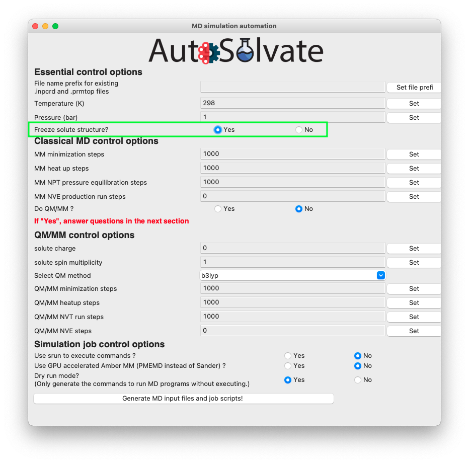

Advanced Tutorial
=============================
Here we introduce some advanced usages of AutoSolvate. To learn the basic usages, please refer to the basic :doc:`tutorial` page.

Advanced Example 1: Custom Solvent
------------------------------------
Apart from the 5 common solvents contained in AutoSolvate, the user can use custom solvents found in databases or literature to build the solvated structure, as long as the `.frcmod` and `.off` files are available.

Here we show a simple use case. We are still going to work on the neutral naphthalene molecule used in the basic :doc:`tutorial`. However, this time we will put it in a custom solvent, dimethylsulfoxide (DMSO), which is not contained in AutoSolvate.

Step 1: Find custom solvent force field files
~~~~~~~~~~~~~~~~~~~~~~~~~~~~~~~~~~~~~~~~~~~~~~
Theoretically, we can generate GAFF force field for any solvent, and use that for our simulation.

However, it is ideal to use the solvent force fields that have been verified in publications and can reliably reproduce experimental results.

For example, if you want to simulate some solute in DMSO, you may want to look for existing Amber force field of DMSO. One online resource is the AMBER parameter database hosted by the Bryce Group at the University of Manchester: `<http://amber.manchester.ac.uk/>`_.

On the website, you may find some solvent boxes available, including DMSO. You will find two downloadable files for the DMSO solvent box:

#. **OFF**: The DMSO solvent box library file 
#. **FRCMOD**: The DMSO force field modification file

You can download them and save as: `dmso.frcmod` and `dmso.off`.

Next, it is very important to find out the name of the solvent box file that will be recognized by AmberTools, and pass this name to AutoSolvate.

If you open the `dmso.off` file, you will see the first few lines as below:

.. code-block:: text
   :linenos:

   !!index array str
    "d"
   !entry.d.unit.atoms table  str name  str type  int typex  int resx  int flags  int seq  int elmnt  dbl chg
    "S" "S" 0 1 131073 1 16 0.307524
    "CT1" "CT" 0 1 131073 2 6 -0.262450

Notice that for a solvent box `OFF` file, the 2nd line is the **name** of the solvent box that can be recognized by AmberTool/tleap.
In this case, the name is `d`. That means, if one loads this `OFF` file and uses tleap to add the solvent box, the corresponding command should be::

>>> solventbox [solute_unit_name] d [box_size] [closeness]

So `d` is the solvent name that we should pass to AutoSolvate.

.. note::

   If you don't like the original solvent box name given in the OFF file, feel free to change it to something else. For example, you can change the 2nd line
   of dmso.off to "DMSO". Later you want to pass the new name, "DMSO" to AutoSolvate

Step 2: Run AutoSolvate with the custom solvent
~~~~~~~~~~~~~~~~~~~~~~~~~~~~~~~~~~~~~~~~~~~~~~~

To generate the solvent box structure and MD prmtop files with custom solvent, the basic procedure is the same as the simple example about adding water (see :doc:`tutorial`).

The only difference is to provide 3 extra options:
#. solvent name (not the real name, but the name given in `OFF` file) with option `-s`
#. solvent `OFF` file path with option `-l`
#. solvent `FRCMOD` file path with option `-p`

Assuming that you have `naphthalene_neutral.xyz`, `dmso.off`, `dmso.frcmod` files all in the current
working directory, and the environment with AutoSolvate installed has been activated.
To add the DMSO solvent box to the neutral naphthalene molecule, you can simply run the following command::

>>> autosolvate boxgen -m naphthalene_neutral.xyz -s d  -l dmso.off -p dmso.frcmod

This command should generate the solvated files: `d_solvated.inpcrd`, `d_solvated.prmtop`, and `d_solvated.pdb`.

Advanced Example 2: Automated recommendation of solvent-solute closeness 
------------------------------------------------------------------------

The automated recommendation of solvent-solute closeness allows to generate initial structures where the closeness is closer to the equilibrated closeness. To demonstrate the automated recommendation of solvent-solute closeness run the following command::

>>> autosolvate boxgen -m naphthalene_neutral.xyz -s water -c 0 -u 1 -t automated

with the option `-t automated` the closeness will be automatically determined from the solvent identity. 

Advanced Example 3: Freeze the solute molecule structure
--------------------------------------------------------

In certain situations, the user may want to add the solvation shell without changing the solute structure. This can be easily done turning on the "freeze solute" option in the command line or in the GUI interface. This will enable the `ibelly` option in Amber, freezing the solute molecule throughout all MD steps. 

.. warning::

   The option "freeze solute" will overwrite all the QM/MM options. QM/MM steps will be set to 0. QM/MM simulation will not run. The reason is that if solute is requested to be frozen, then there is no reason to calculate the QM gradients to update the solute structure. Running QM/MM will be a waste of time, because the expensive QM gradients will never be used.

To freeze the solute from command line, simply add the `-z` or `--freezesolute` option to your command. For example, for the naphthalene in water example shown in :ref:`Tutorial Step 2<tutstep2>`, the command to run MD with frozen solute is:

``autosolvate mdrun -f water_solvated -q 0 -u 1 -t 300 -p 1 -m 10000 -n 10000 -o 100 -s 100 -l 250 -z``

Here, although the user specified the number of steps for QM/MM minimization (`-o`), QMMM heat (`-s`) and QMMM equilibration (`-l`), these options will be ignored and set to 0 because the `-z` option is turned on. The above command is equivalent to 

``autosolvate mdrun -f water_solvated -q 0 -u 1 -t 300 -p 1 -m 10000 -n 10000 -o 0 -s 0 -l 0 -z``

and 

``autosolvate mdrun -f water_solvated -q 0 -u 1 -t 300 -p 1 -m 10000 -n 10000 -z``

To freeze the solute from the GUI interface, select "Yes" for the radial button of the "Freeze solute structure?" option in the *mdrun* GUI, as shown in the picture below.

