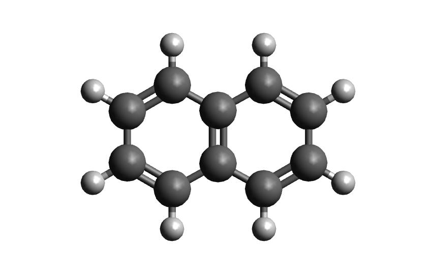
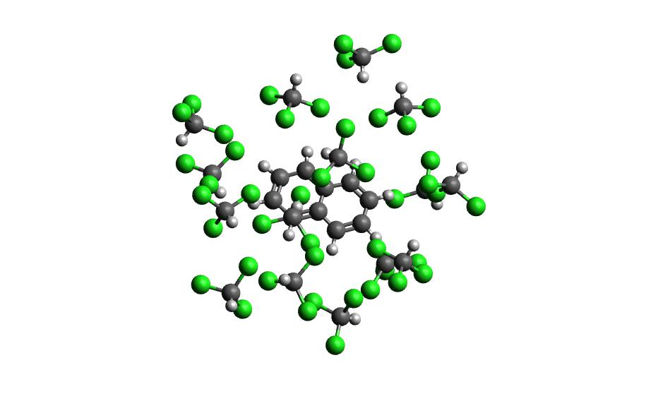
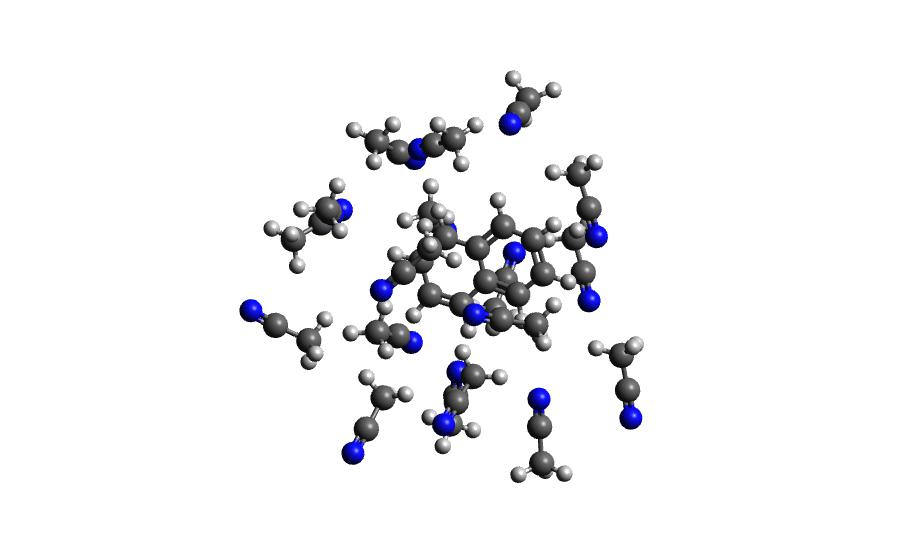

Tutorial
=============================
The following code walkthrough illustrates the usage of Autosolvate in the commnand line interface (CLI).

There will be three example systems: napthalene in water, napthalene radical in chloroform, napthalene in acetonitrile

Prerequisites
-------------------------------------------
Once you have AutoSolvate and all dependencies installed you will need the solute xyz file and then you are ready to go! Make sure to give each molecule its own directory to avoid the possibility of overwriting the amber files when running two at a time. The napthalene neutral and radical coordinates are provided below so that you can follow along on your own computer:

::

    18
    napthalene neutral
     C     2.4397703245   -0.7099883961    0.0000206200
     C     2.4397218526    0.7099981201    0.0000271508
     C     1.2475921776    1.4061556571    0.0000203110
     C    -0.0000128759    0.7189947033    0.0000073141
     C    -1.2476290200    1.4061688746    0.0000008829
     C    -2.4397553974    0.7100487925   -0.0000117263
     C    -2.4397460082   -0.7099448889   -0.0000182422
     C    -1.2476288777   -1.4062156405   -0.0000121401
     C     0.0000138676   -0.7190995078    0.0000006641
     C     1.2476602178   -1.4062240260    0.0000074983
     H     1.2448250471   -2.4927306634    0.0000020169
     H    -1.2447711187   -2.4927196649   -0.0000168971
     H    -3.3840069825   -1.2452230520   -0.0000277743
     H    -3.3839437525    1.2454155894   -0.0000167697
     H    -1.2448430780    2.4926825384    0.0000062499
     H     1.2447883528    2.4926610011    0.0000242506
     H     3.3839630326    1.2452901872    0.0000373621
     H     3.3840333383   -1.2452476243    0.0000259290

::

       18
       napthalene radical
       C     2.4584929186   -0.6980401434    0.0000208854
       C     2.4584830542    0.6980208281    0.0000273558
       C     1.2392834454    1.4064616303    0.0000201346
       C    -0.0000127820    0.7187236077    0.0000072068
       C    -1.2393189424    1.4064428097    0.0000009527
       C    -2.4585398474    0.6980627613   -0.0000119130
       C    -2.4584830245   -0.6980052848   -0.0000182990
       C    -1.2392726206   -1.4064393494   -0.0000121035
       C     0.0000166810   -0.7186826023    0.0000005670
       C     1.2392855074   -1.4064696461    0.0000073561
       H     1.2470800358   -2.4919577916    0.0000018617
       H    -1.2470920207   -2.4919275393   -0.0000168975
       H    -3.3951566422   -1.2429180456   -0.0000277271
       H    -3.3952681112    1.2428765068   -0.0000168560
       H    -1.2469606339    2.4919363439    0.0000063915
       H     1.2471333000    2.4919523490    0.0000239494
       H     3.3951743890    1.2429028846    0.0000376679
       H     3.3951863936   -1.2429173191    0.0000261673

Now that you have the structures, make a directory for each example. We will start with the neutral molecule. 

Example 1: Napthalene in Water
-------------------------------------------

Step 1: Solvate system
~~~~~~~~~~~~~~~~~~~~~~~~~~~~~~~~~~~~~~~~~~~

The first step is putting the solute in the solvent box, which uses the boxgen command. The documentation shows all of the options for this command, but the only one that is required is specifying the solute xyz file. It will be listed as -m for main. To run boxgen with all of the default settings, use the following command:

``autosolvate boxgen -m napthalene_neutral.xyz``

Autosolvate will use the default values of water as the solvent, solute charge of 0, solute multiplicity of 1, charge fitting method of resp, box size of 54, and output file name of water_solvated. 

If AutoSolvate is running successfully, the following messages will be printed to your screen::

  AutoSolvate is starting in command line mode!
  Running the module to generate solvent box and force field parameters.
  ['-m', 'nap_neutral.xyz']
  Main/solutexyz nap_neutral.xyz
  WARNING: Amber home directory is not specified in input options
  WARNING: Checking AMBERHOME environment virable...
  ['echo', '$AMBERHOME']
  WARNING: AMBERHOME detected:  $AMBERHOME
  
  Converting xyz to pdb
  Generate frcmod file for the solute
  cleaning up solute.xyz.pdb
  Then write out mol2
  
  Welcome to antechamber 21.0: molecular input file processor.
  
  acdoctor mode is on: check and diagnose problems in the input file.
  The atom type is set to gaff; the options available to the -at flag are
      gaff, gaff2, amber, bcc, and sybyl.
  -- Check Format for pdb File --
     Status: pass
  -- Check Unusual Elements --
     Status: pass
  -- Check Open Valences --
     Status: pass
  -- Check Geometry --
       for those bonded   
       for those not bonded   
     Status: pass
  -- Check Weird Bonds --
     Status: pass
  -- Check Number of Units --
     Status: pass
  acdoctor mode has completed checking the input file.
  
  Info: Total number of electrons: 68; net charge: 0
  
  Running: /jet/home/agale/miniconda3/envs/autosolvate/bin/sqm -O -i sqm.in -o sqm.out
  
  Finally generate frcmod with parmchk2
  Now create the solute library file
  Generate Amber parameters for the solvated system
  Now add pre-equlibrated solvent box to the solute
  The script has finished successfully

Additionally, you should now have the following files in your directory::

  ANTECHAMBER_AC.AC           ATOMTYPE.INF              nap_neutral.xyz   sqm.in   
  ANTECHAMBER_AC.AC0          leap_add_solventbox.cmd   solute.frcmod     sqm.out  
  ANTECHAMBER_AM1BCC.AC       leap_add_solventbox.log   solute.lib        sqm.pdb  
  ANTECHAMBER_AM1BCC_PRE.AC   leap.cmd                  solute.mol2       water_solvated.inpcrd
  ANTECHAMBER_BOND_TYPE.AC    leap.log                  solute.pdb        water_solvated.pdb
  ANTECHAMBER_BOND_TYPE.AC0   leap_savelib.log          solute.xyz.pdb    water_solvated.prmtop

The three files that we care about for moving forward to the next step are the ones with the output prefix water_solvated (the last three listed above). The ``.inpcrd`` file contains the input coordinates, and the ``.prmtop`` file contains the Amber paramter topology. The ``.pdb`` file has the coordinates for the solute in the solvent box, so you want to check that both the solvent and the solute are there::

        CRYST1   66.461   66.696   66.822  90.00  90.00  90.00 P 1           1
        ATOM      1  C   SLU     1       2.302  -0.634   0.016  1.00  0.00
        ATOM      2  C1  SLU     1       2.302   0.786   0.016  1.00  0.00
        ATOM      3  C2  SLU     1       1.110   1.482   0.016  1.00  0.00
        ATOM      4  C3  SLU     1      -0.138   0.795   0.016  1.00  0.00
        ATOM      5  C4  SLU     1      -1.386   1.482   0.016  1.00  0.00
        ATOM      6  C5  SLU     1      -2.578   0.786   0.016  1.00  0.00
        ATOM      7  C6  SLU     1      -2.578  -0.634   0.016  1.00  0.00
        ATOM      8  C7  SLU     1      -1.386  -1.330   0.016  1.00  0.00
        ATOM      9  C8  SLU     1      -0.138  -0.643   0.016  1.00  0.00
        ATOM     10  C9  SLU     1       1.110  -1.330   0.016  1.00  0.00
        ATOM     11  H   SLU     1       1.107  -2.417   0.016  1.00  0.00
        ATOM     12  H1  SLU     1      -1.383  -2.417   0.016  1.00  0.00
        ATOM     13  H2  SLU     1      -3.522  -1.169   0.016  1.00  0.00
        ATOM     14  H3  SLU     1      -3.522   1.321   0.016  1.00  0.00
        ATOM     15  H4  SLU     1      -1.383   2.569   0.016  1.00  0.00
        ATOM     16  H5  SLU     1       1.107   2.569   0.016  1.00  0.00
        ATOM     17  H6  SLU     1       3.246   1.321   0.016  1.00  0.00
        ATOM     18  H7  SLU     1       3.246  -1.169   0.016  1.00  0.00
        TER
        ATOM     19  O   WAT     2      30.753  27.440  26.571  1.00  0.00
        ATOM     20  H1  WAT     2      30.672  26.525  26.300  1.00  0.00
        ATOM     21  H2  WAT     2      30.339  27.937  25.865  1.00  0.00
        TER
        ATOM     22  O   WAT     3      28.885  29.218  28.452  1.00  0.00
        ATOM     23  H1  WAT     3      28.109  28.738  28.742  1.00  0.00
        ATOM     24  H2  WAT     3      29.536  28.538  28.277  1.00  0.00

The fourth column has 18 'SLU' entries, or solvent, and under that there are 6 'WAT' entries, which we can see makes up two water molecules. When you visualize ``water_solvated.pdb`` you should be able to see the water box containing the solute:

.. image:: _images/tutorial4_2.png
   :width: 400

With these three files, we are ready to proceed to the next step!

.. note::

   This example uses default settings for boxgen, but these can be changed or simply made explict by using more flag options. For example, we can change the charge fitting method to bcc, give the output a more specific name, and explicitly define solvent, charge and multiplicity:

   ``autosolvate boxgen -m napthalene_neutral.xyz -s water -c 0 -u 1 -g "bcc" -o nap_netural``

   The semi-emperical charge fitting available through Amber performs well for closed-shell systems. However, it is not sufficient for open-shell systems, which will require the use of quantum chemistry charge fitting methods. The methods currently available are bcc fitting in Amber and RESP in Gaussian. RESP is the default setting.

Step 2: MD Simulation
~~~~~~~~~~~~~~~~~~~~~~~~~~~~~~~~~~~~~~~~~~~

The second step is running molecular dynamics, which includes equilibration and production time. For this tutorial, we will run a very fast demonstration just to see how the mdrun command works.

To do a short example run of QM/MM use the following command:

``autosolvate mdrun -f water_solvated -q 0 -u 1 -t 300 -p 1 -m 10000 -n 10000 -o 100 -s 100 -l 10 -r "True"``
  
The mdrun command has several more options than the previous one, but the only required options are filename, charge, and multiplicity (the first three in the command above). Note that this command will run both MM and QMMM. By default, the calculations will proceed in the order MM min > MM heat > MM NPT > QMMM min > QMMM heat > QMMM NVT. Any of these can be skipped by setting the number of steps to 0 ( , -m, -n, -l, -o, -s).

If AutoSolvate is running successfully, the following messages will be printed to your screen::

  AutoSolvate is starting in command line mode!
  Running the module to automatically run MD simulations of solvated structure.
  ['-f', 'water_solvated', '-q', '0', '-u', '1', '-t', '300', '-p', '1', '-m', '10000', '-n', '10000', '-o', '100', '-s', '100', '-l', '10', '-r', 'True']
  Filename: water_solvated
  Charge: 0
  Spinmultiplicity: 1
  Temperature in K: 300
  Pressure in bar: 1
  Steps MM heat: 10000
  Steps MM NPT: 10000
  Steps QMMM heat: 100
  Steps QMMM NPT: 100
  Steps QMMM min: 10
  using srun
  MM Energy minimization
  srun: job 5791719 queued and waiting for resources
  srun: job 5791719 has been allocated resources
  MM Heating
  srun: job 5791725 queued and waiting for resources
  srun: job 5791725 has been allocated resources
  MM NPT equilibration
  srun: job 5792049 queued and waiting for resources
  srun: job 5792049 has been allocated resources
  QMMM Energy minimization
  srun: job 5792146 queued and waiting for resources
  srun: job 5792146 has been allocated resources
  QMMM Heating
  srun: job 5792524 queued and waiting for resources
  srun: job 5792524 has been allocated resources
  QMMM NVT Run
  srun: job 5792524 queued and waiting for resources
  srun: job 5792524 has been allocated resources
  
Additionally, these files should all be in your directory now::
 
  inpfile.xyz       mmnpt.info          qmmmmin.ncrst     water_solvated.inpcrd
  mmheat.in         mmnpt.out           qmmmmin.out       water_solvated-heat.netcdf
  mmheat.info       old.tc_job.dat      qmmmnvt.in        water_solvated-mmnpt.netcdf
  mmheat.ncrst      old.tc_job.inp      qmmmnvt.info      water_solvated-qmmmheat.netcdf
  mmheat.out        ptchrg.xyz          qmmmnvt.out       water_solvated-qmmmmin.netcdf
  mmmin.in          qmmmheat.in         qmmm_region.pdb   water_solvated-qmmmnvt.netcdf
  mmmin.info        qmmmheat.info       tc_job.dat
  mmmin.ncrst       qmmmheat.ncrst      tc_job.inp
  mmmin.out         qmmmheat.out        tc_job.tpl
  mm.ncrst          qmmmmin.in          tc_job.tpl.bak
  mmnpt.in          qmmmmin.info        tc_job.tpl.bak

Once everything has finished, the main output is the QM/MM trajectory ``water_solvated-qmmmnvt.netcdf``. When you have this file, you can move on to the next step!

.. warning::

   Longer MM and QM/MM steps are necessary to reach equilibration, and the default settings are more appropriate than what is used here for a production run. 

The default mdrun will have the following settings:

+-----------+-----------------------+------------+
| MD step   | default settings      |flag        |
+===========+=======================+============+
| MM min    |300 K, 1 bar           |   -t, -p   |
+-----------+-----------------------+------------+  
| MM heat   |10000 steps            |   -m       |
+-----------+-----------------------+------------+  
| MM NPT    |300000 steps           |   -n       |
+-----------+-----------------------+------------+  
| QMMM      |0, 1, b3lyp            |-q, -u, -k  | 
+-----------+-----------------------+------------+  
| QMMM min  |250 steps              |   -l       |
+-----------+-----------------------+------------+  
| QMMM heat |1000 steps             |  -o        |
+-----------+-----------------------+------------+  
| QMMM NVT  |10000 steps            |   -s       |
+-----------+-----------------------+------------+  

When you are ready to do a production run and want to use all of these defaults, you can use the dry run option to generate the input files without running them to make sure that everything looks right: 

``autosolvate mdrun -f water_solvated -q 0 -u 1 -d``
  
If AutoSolvate is running successfully, the following messages will be printed to your screen::

  AutoSolvate is starting in command line mode!
  Running the module to automatically run MD simulations of solvated structure.
  ['-f', 'water_solvated', '-q', '0', '-u', '1', '-d']
  Filename: water_solvated
  Charge: 0
  Spinmultiplicity: 1
  Dry run mode: only generate the commands to run MD programs and save them into a file without executing the commands
  MM Energy minimization
  MM Heating
  MM NPT equilibration
  QMMM Energy minimization
  QMMM Heating
  QMMM NVT Run
  
The following files will be added to your directory::

  mmheat.in  qmmmheat.in  runMM.sh
  mmmin.in   qmmmmin.in   runQMMMM.sh
  mmnpt.in   qmmmnvt.in   tc_job.tpl

Inside ``runMM.sh`` and ``runQMMMM.sh``, you will find the commands to run each step of MM and QMMM, respectively. These commands can be copied and pasted into the command line to be run one at a time or can all be pasted into a separate submit script to get the jobs queued on a compute node.

.. warning::

   Especially in this step, it is important to know where your job is running!

   * If you run the autosolvate commands in the command line without any flags for job submission, they will run *on the head node without entering a queue*. The administator will likely cancel your job if you are using HPC resource.
   * If you use the -r flag, they will run *on the head node* as a sander job *in the queue.*
   * If you do not use the -r flag, but call the autosolvate command in your own submit script, they will run *on a compute node in the queue* with whatever settings you designate. If you are running QMMM, this is also where you will load Terachem for the QM part.

Step 3: Microsolvated cluster extraction
~~~~~~~~~~~~~~~~~~~~~~~~~~~~~~~~~~~~~~~~~~~

The last step is extracting a cluster from the previous results that can be used for microsolvation. In the QMMM above, the solute is treated with QM and the explicit solvent molecules are treated with MM. In this step, a cluster will be extracted from the QMMM box so that the cluster can be treated with QM. The explicitly solvated cluster will be surrounded by implicit solvent, and we refer to the implicit + explict combination as microsolvation.

To extract the cluster from the final QMMM results, use the following command:

``autosolvate clustergen -f water_solvated -t water_solvated-qmmmnvt.netcdf -a 0 -i 10 -s 4``

If AutoSolvate is running successfully, the following messages will be printed to your screen::

    AutoSolvate is starting in command line mode!
    Running the module to extract solvated cluster (sphere) from MD trajectories of solvent box.
    ['-f', 'water_solvated', '-t', 'water_solvated-qmmmnvt.netcdf', '-a', '0', '-i', '10', '-s', '4']
    Filename: water_solvated
    Trajectory name: water_solvated-mmnpt.netcdf
    startframe to extract: 0
    interval to extract: 10
    Cutout size in Angstrom: 4
    Loading trajectory
    selecting center solute
    extracting from frames: [0]
    calculating distance to all solvent molecules
    select solvent molecules
    for first frame selected 35 solvent molecules
    saving xyz

The only output of this command will be the cartesian coordinates of the cluster in ``water_solvated-cutoutn-0.xyz``. 

.. image:: _images/tutorial4_3.jpg
   :width: 400

This is because we only did 10 steps of the QMMM NVT in our example mdrun, and we asked for a cluster from every ten frames. However, if we extract clusters from the QMMM heating step (which had 100 steps in our short example), then we will get 10 coordinate files. When you open one of cut out files, the microsolvated cluster should look like this:

``autosolvate clustergen -f water_solvated -t water_solvated-qmmmheat.netcdf -a 0 -i 10 -s 4``

As Autosolvate is running, you will notice this line now includes the list of the 10 frames that the clusters will be extracted from::

  extracting from frames: [0, 10, 20, 30, 40, 50, 60, 70, 80, 90]

.. warning::

   The naming of the microsolvated clusters is based on the name of the .prmtop file, not the trajectory file, so the names will not change between runs. This means that if you run the clustergen command twice, *the new coordinates will overwrite the old ones* (if the frame number is the same). Therefore, if you want to extract clusters from multiple MD steps (like QMMM heat and QMMM NVT), you need to either move or rename the files before you run the command again.

Example 2: Napthalene Radical in Chloroform
----------------------------------------------------------

Now that we have gone through the details of one example, the second example will be the compact version of a production run.

``autosolvate boxgen -m napthalene_radical.xyz -s chloroform -c 1 -u 2 -g "resp" -o nap_radical_chcl3``
  * must designate charge and multiplicty for the radical system
  * must use resp for open-shell system
``autosolvate mdrun -f nap_radical_chcl3 -q 1 -u 2 -d``
  * must designate charge and multiplicty for the radical system
  * make sure to track the output filename from boxgen as the input filename
  * copy the contents of runMM.sh and runQMMM.sh into a submit script that calls Terachem and submits the (very long) job into a queue with sufficient time
``autosolvate clustergen -f nap_radical_chcl3 -t nap_radical_chcl3-qmmmnvt.netcdf -a 0 -i 10 -s 4``
  * make sure to make note of which trajectory the clusters come from

Example 3: Napthalene in Acetonitrile (custom solvent)
----------------------------------------------------------

``autosolvate boxgen -m napthalene_neutral.xyz -s acetonitrile -c 0 -u 1 -g "bcc" -o nap_neutral_MeCN``
  * custom solvent called the same as Amber pre-equilibrated solvent boxes
  * bcc charge method is sufficient for closed-shell system
``autosolvate mdrun -f nap_neutral_MeCN -q 0 -u 1 -l 0 -o 0 -s 0 -d``
  * example with only MM steps in the MDrun
``autosolvate clustergen -f nap_neutral_MeCN -t nap_neutral_MeCN-mmnpt.netcdf -a 0 -i 300 -s 4``
  * make sure the trajectory name is for the MM NPT step
  * MM NPT has 30,000 steps, so you want to significantly increase the interval
  

