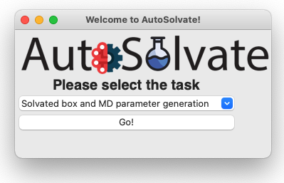
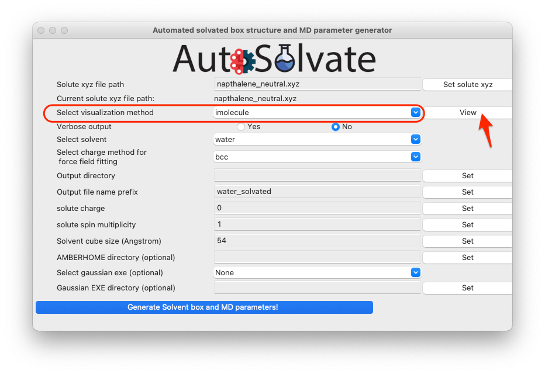
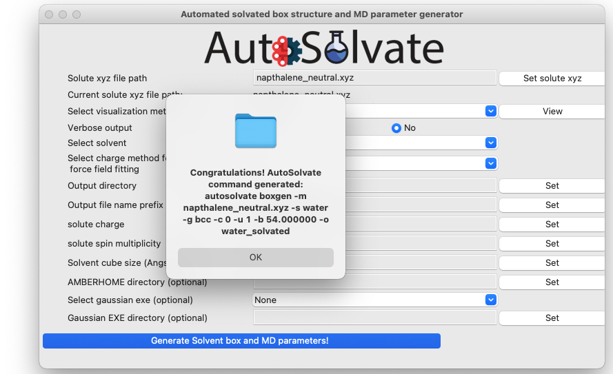
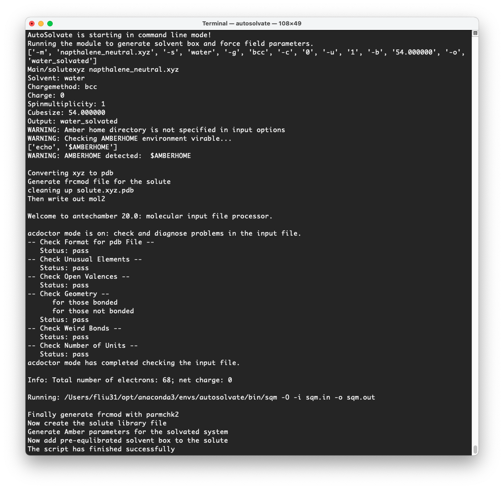

GUI Tutorial
=============================

Following code walkthrough illustrates the usage of Autosolvate in the graphical user interface (GUI).

We will focus on an example systems: napthalene in water.

Prerequisites
-------------------------------------------
Once you have AutoSolvate and all dependencies installed you will need the solute xyz file and then you are ready to go! 
Make a working directory and create the ``napthalene_neutral.xyz`` file, so that you can follow along on your own computer: 

::

  18
  napthalene neutral 
       C     2.4397703245   -0.7099883961    0.0000206200
       C     2.4397218526    0.7099981201    0.0000271508
       C     1.2475921776    1.4061556571    0.0000203110
       C    -0.0000128759    0.7189947033    0.0000073141
       C    -1.2476290200    1.4061688746    0.0000008829
       C    -2.4397553974    0.7100487925   -0.0000117263
       C    -2.4397460082   -0.7099448889   -0.0000182422
       C    -1.2476288777   -1.4062156405   -0.0000121401
       C     0.0000138676   -0.7190995078    0.0000006641
       C     1.2476602178   -1.4062240260    0.0000074983
       H     1.2448250471   -2.4927306634    0.0000020169
       H    -1.2447711187   -2.4927196649   -0.0000168971
       H    -3.3840069825   -1.2452230520   -0.0000277743
       H    -3.3839437525    1.2454155894   -0.0000167697
       H    -1.2448430780    2.4926825384    0.0000062499
       H     1.2447883528    2.4926610011    0.0000242506
       H     3.3839630326    1.2452901872    0.0000373621
       H     3.3840333383   -1.2452476243    0.0000259290

Step 1: Solvate system
-------------------------------------------

The first step is putting the solute in the solvent box.
First make sure you have the autosolvate conda environment activated. Then in the terminal under your current working diretory, type

>>> autosolvate

This will start the main GUI for AutoSolvate, as shown below.

The three main functions of AutoSolvate are listed in the dropdown menu. From the dropdown menu, select the first task ``Solvated box and MD parameter generation``, as shown below.

.. image:: _images/tutorial1_2.png
   :width: 400

Then click ``Go!``:

.. image:: _images/tutorial1_3.png
   :width: 400

A new window will pop up, which is the GUI for creating the solvated box and MD force field parameters:

.. image:: _images/tutorial1_4.png
   :width: 800

You will then go through each item listed on the GUI. Some options/entries are pre-populated with default setting. If you want to change from the default setting, enter your input in the corresponding entry and click ``Set``.

.. warning::
   When you change an entry, make sure to click the ``Set`` button to make the change take effect.

For some required entries, if you don't entry anything and directly click ``Set``, a dialog window will pop up and remind you to enter eligible inputs.

For example, you can leave the solute xyz file path blank and directly click on ``Set solute xyz``. Then a new window will popup and ask you to select a file from your computer, as shown below.

.. image:: _images/tutorial1_5.png
   :width: 800

Once a valid file is selected, the path of that file will be shown on the GUI below the entry to confirm your selection:

.. image:: _images/tutorial1_5_2.png
   :width: 800

You can also visualize the structure of the ``xyz`` file to confirm that it is the correct molecule you want. Simply select the visualization method and click ``View``:

By default, we use the ``imolecule`` package to view the molecule, and you will see a new window in your default web browswer, as shown below.

.. image:: _images/tutorial1_6.png
   :width: 800

For this example, because it is neutral napthalene molecule, the default settings will work OK, so you can skip setting the rest options, and directly click the last button to generate structure and force field files:

.. image:: _images/tutorial1_7.png
   :width: 800

A dialog window will pop up and let you know that the corresponding command line input has been generated, which will be executed to generate the files. You can click "OK".

Another dialog window will pop up and ask you whether you want to continue to execute the command and generate the files. You can click ``Cancel`` and no file will be generated, if you want to make changes to the settings. Otherwise, click ``Yes``.

.. image:: _images/tutorial1_9.png
   :width: 800

After a few seconds, you will see a diaglog window pop up with the message to show the generation has finished.

.. image:: _images/tutorial1_10.png
   :width: 800

At the same time, in the original terminal where you launched AutoSolvate, you will see information about each step of the structure and force field genearation

Step 2: MD Simulation
-------------------------------------------

The second step is running molecular dynamics, which includes equilibration and production time. For this tutorial, we will run a very fast demonstration just to see how the mdrun command works.

To do a short example run of QM/MM use the following command:

``autosolvate mdrun -f water_solvated -q 0 -u 1 -t 300 -p 1 -m 10000 -n 10000 -o 100 -s 100 -l 10 -r "True"``
  
The mdrun command has several more options than the previous one, but the only required options are filename, charge, and multiplicity (the first three in the command above). Note that this command will run both MM and QMMM. By default, the calculations will proceed in the order MM min > MM heat > MM NPT > QMMM min > QMMM heat > QMMM NVT. Any of these can be skipped by setting the number of steps to 0 ( , -m, -n, -l, -o, -s).

If AutoSolvate is running successfully, the following messages will be printed to your screen::

  AutoSolvate is starting in command line mode!
  Running the module to automatically run MD simulations of solvated structure.
  ['-f', 'water_solvated', '-q', '0', '-u', '1', '-t', '300', '-p', '1', '-m', '10000', '-n', '10000', '-o', '100', '-s', '100', '-l', '10', '-r', 'True']
  Filename: water_solvated
  Charge: 0
  Spinmultiplicity: 1
  Temperature in K: 300
  Pressure in bar: 1
  Steps MM heat: 10000
  Steps MM NPT: 10000
  Steps QMMM heat: 100
  Steps QMMM NPT: 100
  Steps QMMM min: 10
  using srun
  MM Energy minimization
  srun: job 5791719 queued and waiting for resources
  srun: job 5791719 has been allocated resources
  MM Heating
  srun: job 5791725 queued and waiting for resources
  srun: job 5791725 has been allocated resources
  MM NPT equilibration
  srun: job 5792049 queued and waiting for resources
  srun: job 5792049 has been allocated resources
  QMMM Energy minimization
  srun: job 5792146 queued and waiting for resources
  srun: job 5792146 has been allocated resources
  QMMM Heating
  srun: job 5792524 queued and waiting for resources
  srun: job 5792524 has been allocated resources
  QMMM NVT Run
  srun: job 5792524 queued and waiting for resources
  srun: job 5792524 has been allocated resources
  
Additionally, these files should all be in your directory now::
 
  inpfile.xyz       mmnpt.info          qmmmmin.ncrst     water_solvated.inpcrd
  mmheat.in         mmnpt.out           qmmmmin.out       water_solvated-heat.netcdf
  mmheat.info       old.tc_job.dat      qmmmnvt.in        water_solvated-mmnpt.netcdf
  mmheat.ncrst      old.tc_job.inp      qmmmnvt.info      water_solvated-qmmmheat.netcdf
  mmheat.out        ptchrg.xyz          qmmmnvt.out       water_solvated-qmmmmin.netcdf
  mmmin.in          qmmmheat.in         qmmm_region.pdb   water_solvated-qmmmnvt.netcdf
  mmmin.info        qmmmheat.info       tc_job.dat
  mmmin.ncrst       qmmmheat.ncrst      tc_job.inp
  mmmin.out         qmmmheat.out        tc_job.tpl
  mm.ncrst          qmmmmin.in          tc_job.tpl.bak
  mmnpt.in          qmmmmin.info        tc_job.tpl.bak

Once everything has finished, the main output is the QM/MM trajectory water_solvated-qmmmnvt.netcdf. When you have this file, you can move on to the next step!

**Notes for production runs**

Longer MM and QM/MM steps are necessary to reach equilibration, and the default settings are more appropriate than what is used here for a production run. The default mdrun will have the following settings:

+-----------+---------------------------------+------------+
| MD step   | default settings                |flag        |
+===========+=================================+============+
| MM min    |300 K, 1 bar                     |   -t, -p   |
+-----------+---------------------------------+------------+  
| MM heat   |10000 steps                      |   -m       |
+-----------+---------------------------------+------------+  
| MM NPT    |300000 steps                     |   -n       |
+-----------+---------------------------------+------------+  
| QMMM      |0, 1, b3lyp                      |-q, -u, -k  |
+-----------+---------------------------------+------------+  
| QMMM min  |250 steps                        |   -l       |
+-----------+---------------------------------+------------+  
| QMMM heat |1000 steps                       |  -o        |
+-----------+---------------------------------+------------+  
| QMMM NVT  |10000 steps                      |   -s       |
+-----------+---------------------------------+------------+  

When you are ready to do a production run and want to use all of these defaults, you can use the dry run option to generate the input files without running them to make sure that everything looks right: 

``autosolvate mdrun -f water_solvated -q 0 -u 1 -d``
  
If AutoSolvate is running successfully, the following messages will be printed to your screen::

  AutoSolvate is starting in command line mode!
  Running the module to automatically run MD simulations of solvated structure.
  ['-f', 'water_solvated', '-q', '0', '-u', '1', '-d']
  Filename: water_solvated
  Charge: 0
  Spinmultiplicity: 1
  Dry run mode: only generate the commands to run MD programs and save them into a file without executing the commands
  MM Energy minimization
  MM Heating
  MM NPT equilibration
  QMMM Energy minimization
  QMMM Heating
  QMMM NVT Run
  
The following files will be added to your directory::

  mmheat.in  qmmmheat.in  runMM.sh
  mmmin.in   qmmmmin.in   runQMMMM.sh
  mmnpt.in   qmmmnvt.in   tc_job.tpl

Inside runMM.sh and runQMMMM.sh, you will find the commands to run each step of MM and QMMM, respectively. These commands can be copied and pasted into the command line to be run one at a time or can all be pasted into a separate submit script to get the jobs queued on a compute node.

**Warning**

Especially in this step, it is important to know where your job is running!

* If you run the autosolvate commands in the command line without any flags for job submission, they will run *on the head node without entering a queue*. The administator will likely cancel your job if you are using HPC resource.

* If you use the -r flag, they will run *on the head node* as a sander job *in the queue.*

* If you do not use the -r flag, but call the autosolvate command in your own submit script, they will run *on a compute node in the queue* with whatever settings you designate. If you are running QMMM, this is also where you will load Terachem for the QM part.

Step 3: Microsolvated cluster extraction
-------------------------------------------

The last step is extracting a cluster from the previous results that can be used for microsolvation. In the QMMM above, the solute is treated with QM and the explicit solvent molecules are treated with MM. In this step, a cluster will be extracted from the QMMM box so that the cluster can be treated with QM. The explicitly solvated cluster will be surrounded by implicit solvent, and we refer to the implicit + explict combination as microsolvation.

To extract the cluster from the final QMMM results, use the following command:

``autosolvate clustergen -f water_solvated -t water_solvated-qmmmnvt.netcdf -a 0 -i 10 -s 4``

If AutoSolvate is running successfully, the following messages will be printed to your screen::

    AutoSolvate is starting in command line mode!
    Running the module to extract solvated cluster (sphere) from MD trajectories of solvent box.
    ['-f', 'water_solvated', '-t', 'water_solvated-qmmmnvt.netcdf', '-a', '0', '-i', '10', '-s', '4']
    Filename: water_solvated
    Trajectory name: water_solvated-mmnpt.netcdf
    startframe to extract: 0
    interval to extract: 10
    Cutout size in Angstrom: 4
    Loading trajectory
    selecting center solute
    extracting from frames: [0]
    calculating distance to all solvent molecules
    select solvent molecules
    for first frame selected 35 solvent molecules
    saving xyz

The only output of this command will be the cartesian coordinates of the cluster in water_solvated-cutoutn-0.xyz. This is because we only did 10 steps of the QMMM NVT in our example mdrun, and we asked for a cluster from every ten frames. However, if we extract clusters from the QMMM heating step (which had 100 steps in our short example), then we will get 10 coordinate files.

``autosolvate clustergen -f water_solvated -t water_solvated-qmmmheat.netcdf -a 0 -i 10 -s 4``

As Autosolvate is running, you will notice this line now includes the list of the 10 frames that the clusters will be extracted from::

  extracting from frames: [0, 10, 20, 30, 40, 50, 60, 70, 80, 90]

**Warning** 

The naming of the microsolvated clusters is based on the name of the .prmtop file, not the trajectory file, so the names will not change between runs. This means that if you run the clustergen command twice, the new coordinates will overwrite the old ones (if the frame number is the same). Therefore, if you want to extract clusters from multiple MD steps (like QMMM heat and QMMM NVT), you need to either move or rename the files before you run the command again.

