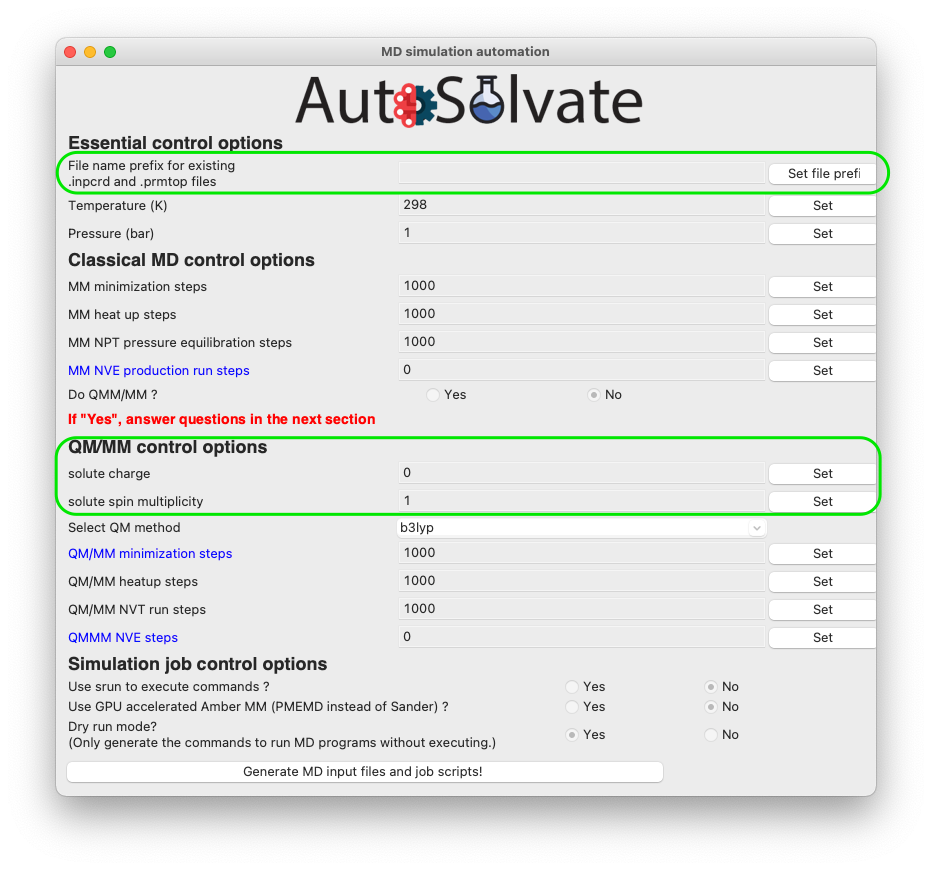
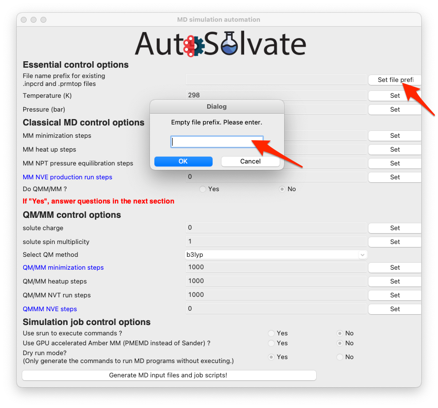
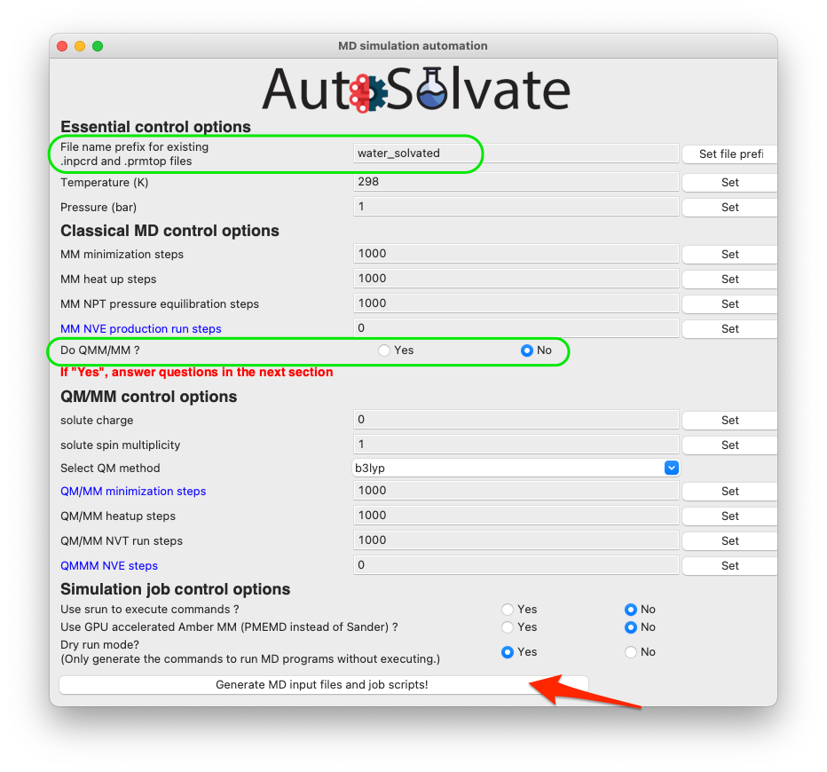
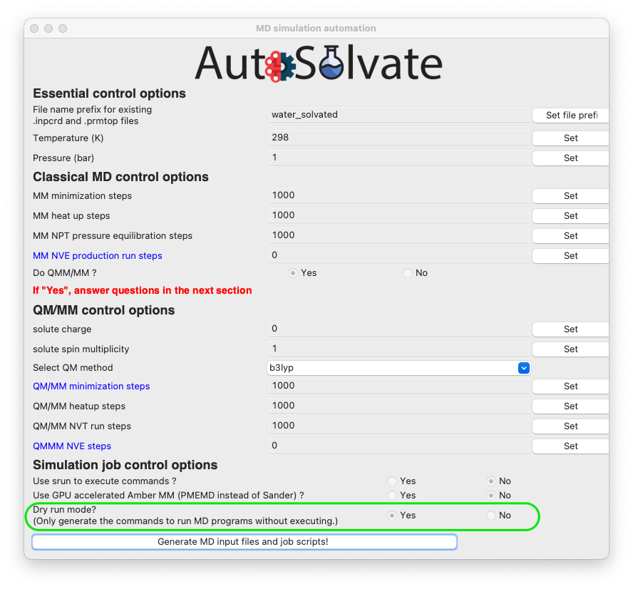
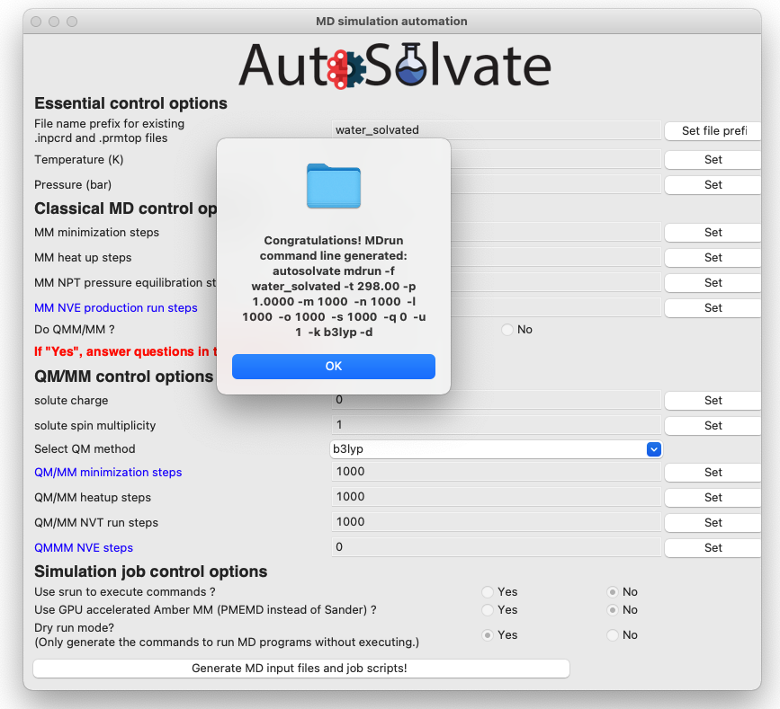
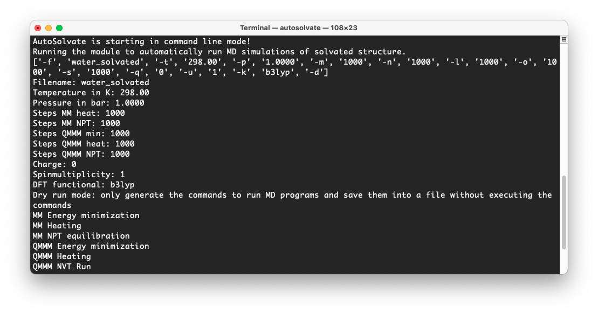

GUI Tutorial
=============================

Following code walkthrough illustrates the usage of Autosolvate in the graphical user interface (GUI).

We will focus on an example systems: napthalene in water.

Prerequisites
-------------------------------------------
Once you have AutoSolvate and all dependencies installed you will need the solute xyz file and then you are ready to go! 
Make a working directory and create the ``napthalene_neutral.xyz`` file, so that you can follow along on your own computer: 

::

  18
  napthalene neutral 
       C     2.4397703245   -0.7099883961    0.0000206200
       C     2.4397218526    0.7099981201    0.0000271508
       C     1.2475921776    1.4061556571    0.0000203110
       C    -0.0000128759    0.7189947033    0.0000073141
       C    -1.2476290200    1.4061688746    0.0000008829
       C    -2.4397553974    0.7100487925   -0.0000117263
       C    -2.4397460082   -0.7099448889   -0.0000182422
       C    -1.2476288777   -1.4062156405   -0.0000121401
       C     0.0000138676   -0.7190995078    0.0000006641
       C     1.2476602178   -1.4062240260    0.0000074983
       H     1.2448250471   -2.4927306634    0.0000020169
       H    -1.2447711187   -2.4927196649   -0.0000168971
       H    -3.3840069825   -1.2452230520   -0.0000277743
       H    -3.3839437525    1.2454155894   -0.0000167697
       H    -1.2448430780    2.4926825384    0.0000062499
       H     1.2447883528    2.4926610011    0.0000242506
       H     3.3839630326    1.2452901872    0.0000373621
       H     3.3840333383   -1.2452476243    0.0000259290

Step 1: Solvate system
-------------------------------------------

The first step is putting the solute in the solvent box.
First make sure you have the autosolvate conda environment activated. Then in the terminal under your current working diretory, type

>>> autosolvate

This will start the main GUI for AutoSolvate, as shown below.

.. image:: _images/tutorial1_1.png
   :width: 400

The three main functions of AutoSolvate are listed in the dropdown menu. From the dropdown menu, select the first task ``Solvated box and MD parameter generation``, as shown below.

.. image:: _images/tutorial1_2.png
   :width: 400

Then click ``Go!``:

.. image:: _images/tutorial1_3.png
   :width: 400

A new window will pop up, which is the GUI for creating the solvated box and MD force field parameters:

.. image:: _images/tutorial1_4.png
   :width: 800

You will then go through each item listed on the GUI. Some options/entries are pre-populated with default setting. If you want to change from the default setting, enter your input in the corresponding entry and click ``Set``.

.. warning::
   When you change an entry, make sure to click the ``Set`` button to make the change take effect.

For some required entries, if you don't entry anything and directly click ``Set``, a dialog window will pop up and remind you to enter eligible inputs.

For example, you can leave the solute xyz file path blank and directly click on ``Set solute xyz``. Then a new window will popup and ask you to select a file from your computer, as shown below.

.. image:: _images/tutorial1_5.png
   :width: 800

Once a valid file is selected, the path of that file will be shown on the GUI below the entry to confirm your selection:

.. image:: _images/tutorial1_5_2.png
   :width: 800

You can also visualize the structure of the ``xyz`` file to confirm that it is the correct molecule you want. Simply select the visualization method and click ``View``:

.. image:: _images/tutorial1_6_0.png
   :width: 800

By default, we use the ``imolecule`` package to view the molecule, and you will see a new window in your default web browswer, as shown below.

.. image:: _images/tutorial1_6.png
   :width: 800

For this example, because it is neutral napthalene molecule, the default settings will work OK, so you can skip setting the rest options, and directly click the last button to generate structure and force field files:

.. image:: _images/tutorial1_7.png
   :width: 800

A dialog window will pop up and let you know that the corresponding command line input has been generated, which will be executed to generate the files. You can click "OK".

.. image:: _images/tutorial1_8.png
   :width: 800

Another dialog window will pop up and ask you whether you want to continue to execute the command and generate the files. You can click ``Cancel`` and no file will be generated, if you want to make changes to the settings. Otherwise, click ``Yes``.

.. image:: _images/tutorial1_9.png
   :width: 800

After a few seconds, you will see a diaglog window pop up with the message to show the generation has finished.

.. image:: _images/tutorial1_10.png
   :width: 400

At the same time, in the original terminal where you launched AutoSolvate, and you will see information about each step of the structure and force field genearation

.. image:: _images/tutorial1_11.png
   :width: 800

Step 2: MD Simulation
-------------------------------------------

The second step is running molecular dynamics, which includes multiple steps with MM or QM/MM dynamics. 
We will show how to quickly enable automated MD input file generation and MD simulation execution from the graphical interface.

Assuming you just finished Step 1, now we can safely close the window for boxgen (you can also leave it there), and focus back on the main GUI. This time select the second task: ``MD simulation automation``
  
.. image:: _images/tutorial2_1.png
   :width: 300

Then click ``Go!``: A new window will pop up, which is the *mdrun* GUI for MD automation.
The *mdrun* GUI has many options categorized into 4 groups, about essnetial setting of the MD simulation, classical MM, QM/MM, and job control. 
Don't be scared by the many options. The only required options are filename, charge, and multiplicity (needed for QMMM), as shown in the green circles blow.

You will then go through each item listed on the GUI. Some options/entries are pre-populated with default setting. If you want to change from the default setting, enter your input in the corresponding entry and click ``Set``.

.. warning::
   When you change an entry, make sure to click the ``Set`` button to make the change take effect.

For some required entries, if you don't entry anything and directly click ``Set``, a dialog window will pop up and remind you to enter eligible inputs.

For example, you can leave the entry about file prefix for ``.inpcrd`` and ``.prmtop`` file blank, and directly click ``Set file prefix``. Then a new window will popup and ask you to enter the valid system prefix, as shown below.

.. warning:: The program will automatically check whether the file prefix you provided is valid, i.e., whether ``prefix.inpcrd`` and ``prefix.prmtop`` both exist. If not, the window will pop up again until you enter a valid file prefix there.

Once you entered a valid file prefix, the dialog will automatically close, and you can make other neccessary changes to the options. For this neutral, singlet molecule, the default setting is OK. However, be careful that the QM/MM option is turned off by default, because the TeraChem package is not automatically installed with AutoSolvate, so the user may not neccessary have acceess to the QM/MM run with TeraChem. If everything looks good to you, you can directly go to click the last button to generate MD simulation inputs and execute MD.

If you do want to run QM/MM, simply change the radio button to ``Yes`` (shown in the green circle below), and set corresponding options in the QM/MM control section.

.. image:: _images/tutorial2_5.png
   :width: 400

The most important option for QM/MM is the QM method, which is by default DFT with B3LYP functional. You can change it to other available options by choosing from the dropdown menu:

.. image:: _images/tutorial2_6.png
   :width: 400

Another very important feature is the ``dryrun`` mode, that means the GUI will only generate the MD input files, and save the commands to run Amber/sander MD simulations input bash script files ``runMM.sh`` and ``runQMMM.sh``. The GUI will not directly execute Amber or Amber/TeraChem to run the MD simulations, because usually we expect the users to use the GUI on their desktop, which is not suitable for running long-time MD simulations. By using the ``dryrun`` mode, the user can get the needed files and scripts, and then copy them to high-performance computers to finish the simulation.

Therefore, the ``dryrun`` mode is by default turned on, as shown below:

If everything looks good to you, you can click the last button to generate MD simulation inputs and execute MD.
A dialog window will pop up and let you know that the corresponding command line input has been generated, which will be executed to generate the MD simulation files. You can click "OK".

Another dialog window will pop up and ask you whether you want to continue to execute the command and generate the files. You can click ``Cancel`` and no file will be generated, if you want to make changes to the settings. Otherwise, click ``Yes``.

.. image:: _images/tutorial2_8.png
   :width: 400

If you selected ``dryrun`` mode, after a few seconds, you will see a diaglog window pop up with the message to show the MD simulation generation has finished. If you selected to turn off ``dryrun`` mode, then AutoSolvate will call Amber/sander in the background and run the MD simulations, which may take minutes or hours to finish. But at the end you will also see a dialog window saying that the simulation has finished.

.. image:: _images/tutorial2_9.png
   :width: 400

At the same time, in the original terminal where you launched AutoSolvate ``mdrun`` module, and you will see information about each step of the MD simulation

Step 3: Microsolvated cluster extraction
-------------------------------------------

The last step is extracting a cluster from the previous results that can be used for microsolvation. 

**Warning** 

The naming of the microsolvated clusters is based on the name of the .prmtop file, not the trajectory file, so the names will not change between runs. This means that if you run the clustergen command twice, the new coordinates will overwrite the old ones (if the frame number is the same). Therefore, if you want to extract clusters from multiple MD steps (like QMMM heat and QMMM NVT), you need to either move or rename the files before you run the command again.

