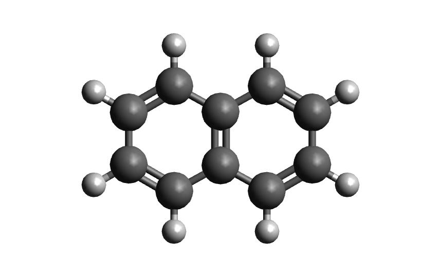
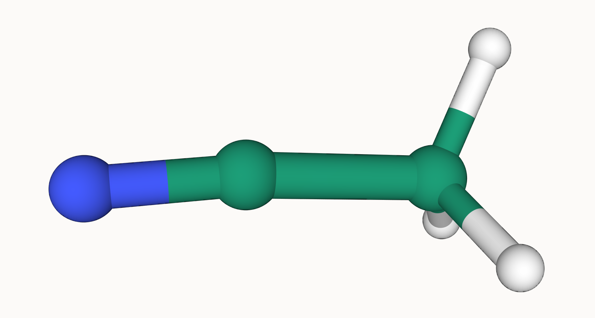
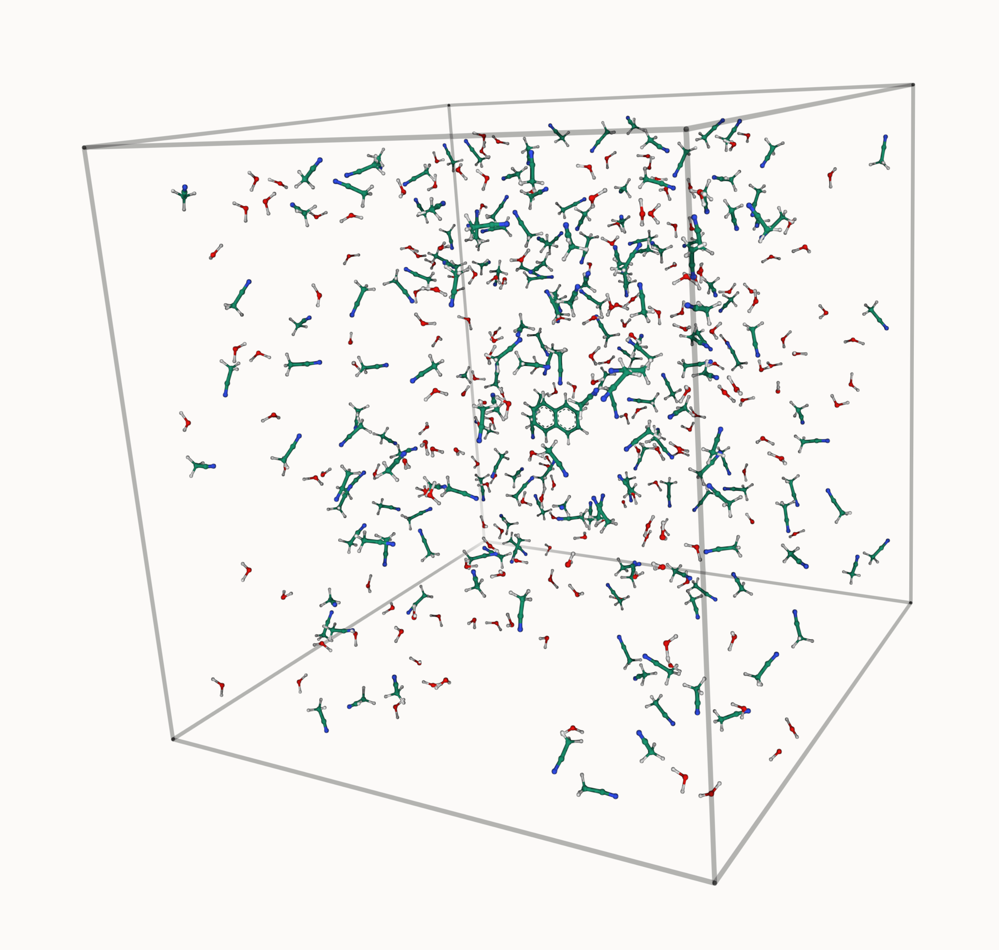
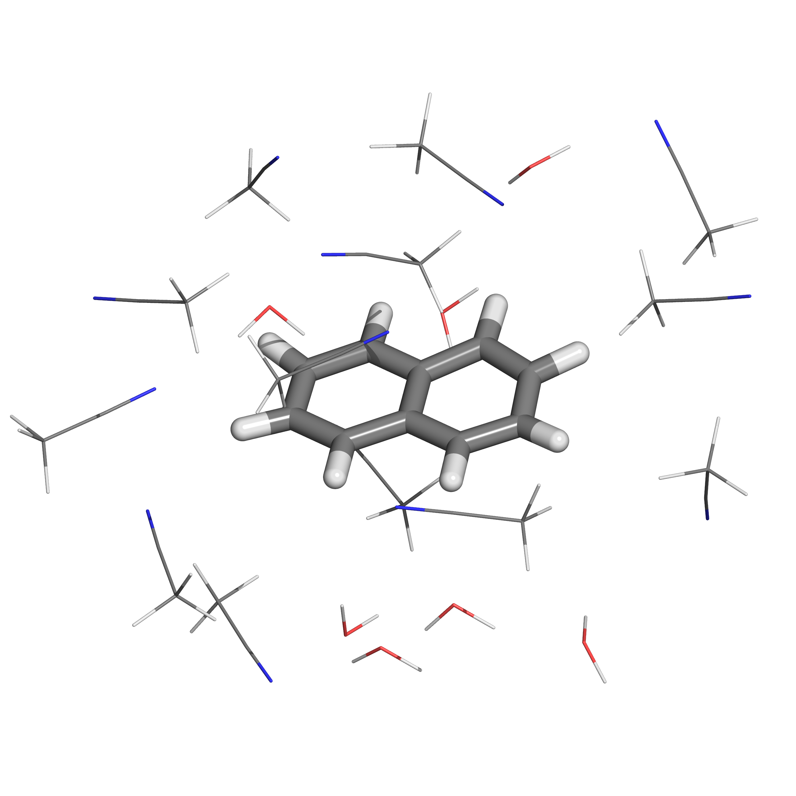

Tutorial for AutoSolvate Multicomponent
=========================================

Introduction
-------------------------------------------
The **Multicomponent** module is an powerful extension of the standard AutoSolvate workflow and the AutoMCPB module, this module enables the following advanced functionalities:

- Interactive CLI for building complex multicomponent systems.
- Mixed solvent box generation with arbitrary organic and aqueous solvents.
- Specifying the solvent composition by molecule number, weight ratio, volume ratio, or molar ratio.
- Multiple solutes in the same solvent box.
- Input pre-defined force field parameters for solute/solvent molecules.
- Organometallic compounds and counterions in mixed solvents.

Due to the module's powerful functionality, it is invoked by JSON input files. The traditional CLI interface is retained only as a legacy option.

The following tutorial illustrates the basic usage of the **Multicomponent** module in the command line interface (CLI).

This tutorial contains two examples:

1. Naphthalene in a mixed water/acetonitrile solvent box.
2. A transition metal complex (Febpy3) with counterions in a mixed carbonate solvent box.
3. Using the interactive CLI to build complex multicomponent systems.

Example 1: Naphthalene in mixed water/acetonitrile
-------------------------------------------------

Prerequisites
^^^^^^^^^^^^^
Once you have AutoSolvate and all dependencies installed you will need the pdb files for solute and solvents. However, the TIP3P water model are pre-defined in AMBER so you don't need to prepare its pdb or xyz file. Make sure run the example in its own directory to have clear separation of files.

naphthalene_neutral.xyz:
::

    18
    naphthalene neutral
     C     2.4397703245   -0.7099883961    0.0000206200
     C     2.4397218526    0.7099981201    0.0000271508
     C     1.2475921776    1.4061556571    0.0000203110
     C    -0.0000128759    0.7189947033    0.0000073141
     C    -1.2476290200    1.4061688746    0.0000008829
     C    -2.4397553974    0.7100487925   -0.0000117263
     C    -2.4397460082   -0.7099448889   -0.0000182422
     C    -1.2476288777   -1.4062156405   -0.0000121401
     C     0.0000138676   -0.7190995078    0.0000006641
     C     1.2476602178   -1.4062240260    0.0000074983
     H     1.2448250471   -2.4927306634    0.0000020169
     H    -1.2447711187   -2.4927196649   -0.0000168971
     H    -3.3840069825   -1.2452230520   -0.0000277743
     H    -3.3839437525    1.2454155894   -0.0000167697
     H    -1.2448430780    2.4926825384    0.0000062499
     H     1.2447883528    2.4926610011    0.0000242506
     H     3.3839630326    1.2452901872    0.0000373621
     H     3.3840333383   -1.2452476243    0.0000259290

acetonitrile.prep:
::

   0 0 2

   modelitzacio d'acetonitril com solvent CH3CN
   ace.res
   ACE INT 0
   CHANGE  NOMIT DU BEG
   0.000000
   1 DUMM DU M       -5.298       3.870      -0.861     0.000000
   2 DUMM DU M       -5.925       3.000      -0.328     0.000000      
   3 DUMM DU M       -5.298      -3.870      -0.861     0.000000
   4 N1   YN M        0.314       1.215      -0.429    -0.489715
   5 C2   YC M        1.223       0.576      -0.198     0.382240
   6 C3   CT M        2.399      -0.250       0.102    -0.236648
   7 H4   HC E        2.688      -0.801      -0.783     0.114711
   8 H5   HC E        3.217       0.385       0.414     0.114711
   9 H6   HC E        2.159      -0.945       0.896     0.114711

   DONE
   STOP 

Now that you have the structures, make a directory for the tutorial and move the files into it:: 
   
   acetonitrile.frcmod  acetonitrile.prep  naphthalene_neutral.xyz

.. note::

   You can download all files you need to proceed with the tutorial here. 

   :download:`naphthalene_neutral.xyz <_data/multicomponent_tutorial/naphthalene_neutral.xyz>`
   :download:`acetonitrile.prep <_data/multicomponent_tutorial/acetonitrile.prep>`
   :download:`acetonitrile.frcmod <_data/multicomponent_tutorial/acetonitrile.frcmod>`  

Step 1: Generate the mixed solvent box with JSON input
^^^^^^^^^^^^^^^^^^^^^^^^^^^^^^^^^^^^^^^^^^^^^^^^^^^^^^

The first step is putting the solute in the solvent box, which uses the ``autosolvate boxgen_multicomponent`` command. The usage for multiple solvent requires a **json** file as the input, but the command line options will still be available for single solute with single solvent. 

step1_input.json:
::

   {
      "cubesize": 30,
      "solute": {
         "xyzfile": "naphthalene_neutral.xyz",
         "name": "naphthalene",
         "residue_name": "NAP"
      },
      "solvents":[
         {
               "name": "water",
               "number": 397
         },
         {
               "name": "acetonitrile", 
               "number": 175,
               "prep": "acetonitrile.prep",
               "frcmod": "acetonitrile.frcmod"
         }

      ]
   }  

The first keyword ``cubesize`` specifies the size of the solvent box in Angstrom. 

The ``solute`` section specifies the **xyz** or **pdb** file of the solute. The ``name`` and ``residue_name`` are the name of the solute and its residue name, which will be autogenerated from the structure file name if not provided.

The ``solvents`` section is a list of json objects. Here we specify 175 acetonitrile and 397 water molecule to create a mixed solution with equal mass fractions. 

.. warning::
   The calculations here assume that the density of the mixture is equal to the average of the two components, which is generally NOT true. When the actual density of the mixture is unknown, the mixed solvent box need to be fully equilibrated under the NPT ensemble before the production run. 

When defining the first solvent "water", only the name and the number of molecules are required as the TIP3P water model is already defined in AMBER.

When defining the second solvent "acetonitrile", we provided the ``acetonitrile.frcmod`` to specify the missing force field parameters. In addition, a AMBER preparation file ``acetonitrile.prep`` is provided to specify the structure, topology, atom name, dummy atoms, and atomic charge of acetonitrile.

.. note::
   The required arguments of defining a solvent has the following three cases. 

   1. For pre-defined AMBER solvents "water", "methanol", "chloroform", and "nma" (N-Methylaniline). Only the correct name and the number of molecules are required.

   2. For custom solvents with pre-defined force field parameters, a **frcmod** file is required. In addition, a structure file with correct atom types and atomic charges must be provided. This includes **prep**, **off**, **lib** and **mol2** files. 

   3. For solvents without force field parameters, one can provide the **xyz** or **pdb** file of the solvent. Then the forcefield parameters will be autogenerated with the General Amber Force Field (GAFF). 

   Multicomponent solvent box generation does not support pre-built solvent boxes.

Execute the following command to generate the solvent box of naphthalene in mixed water and acetonitrile solution
::

   autosolvate boxgen_multicomponent -f step1_input.json

Autosolvate will calculate the forcefield parameters for the solute (naphthalene_neutral), and adapt the provided acetonitrile parameters together with the TIP3P water model to build the solvent box. The output ``.pdb``, ``.prmtop``, and ``.inpcrd`` files for the generated system will be automatically named with the prefix ``naphthalene-water-acetonitrile``. You can change the prefix by specifying the ``output`` keyword in the json file.

Most output information will be printed in the ``autosolvate.log`` file in the working directory. If the command run successfully, you should now have the following files in your directory::

   acetonitrile.frcmod        leap_convert.cmd                         naphthalene.prmtop
   acetonitrile-fromprep.pdb  leap.log                                 naphthalene-water-acetonitrile.inpcrd
   acetonitrile.pdb           leap_naphthalene.cmd                     naphthalene-water-acetonitrile_packmol.inp
   acetonitrile.prep          leap_naphthalene.log                     naphthalene-water-acetonitrile_packmol.out
   ANTECHAMBER_AC.AC          leap_naphthalene-water-acetonitrile.cmd  naphthalene-water-acetonitrile.pdb
   ANTECHAMBER_AC.AC0         leap_naphthalene-water-acetonitrile.log  naphthalene-water-acetonitrile.prmtop
   ANTECHAMBER_AM1BCC.AC      naphthalene.frcmod                       sqm.in
   ANTECHAMBER_AM1BCC_PRE.AC  naphthalene.inpcrd                       sqm.out
   ANTECHAMBER_BOND_TYPE.AC   naphthalene.lib                          sqm.pdb
   ANTECHAMBER_BOND_TYPE.AC0  naphthalene.mol2                         step1_input.json
   ATOMTYPE.INF               naphthalene_neutral.xyz                  water.pdb
   autosolvate.log            naphthalene.pdb

The three files that we care about for moving forward to the next step are the ones with the output prefix ``naphthalene-water-acetonitrile`` (``naphthalene-water-acetonitrile.inpcrd``, ``naphthalene-water-acetonitrile.prmtop``, ``naphthalene-water-acetonitrile.pdb``). The ``.inpcrd`` file contains the input coordinates, and the ``.prmtop`` file contains the Amber parameter topology. The PDB file ``naphthalene-water-acetonitrile.pdb`` has the coordinates for the solvent box for visualization. You should be able to see the mixed-solvent (water/acetonitrile) box containing the solute (naphthalene):

.. note::   

   This example uses default settings for boxgen_multicomponent, which uses AM1-BCC for charge fitting with autogenerated solvent box name and default closeness 2.0 Angstrom. These parameters can be explicitly specified in the json. In addition, AutoSolvate assumes the solute and solvent is neutral and singlet. One can specify the ``charge`` and ``spinmult`` arguments in the corresponding json object if needed.
   
   For example, we can specify the charge fitting method as 'bcc', give the output the name "mybox", set the closeness to a smaller value 1.8, and explicitly define the charge and multiplicity for both the solute and the solvent acetonitrile. The charge of the solvent water cannot be specified unless a ``.xyz/.pdb`` file, or a ``.prep/.off`` and ``.frcmod`` file is provided, which will let AutoSolvate recognize it as a custom solvent instead of the pre-defined TIP3P water. The updated json file will look like this:

   step1_input.json:
   ::

      {
         "cubesize": 30,
         "chargemethod": "bcc",
         "output": "mybox",
         "closeness": 1.8,
         "solute": {
            "xyzfile": "naphthalene_neutral.xyz",
            "name": "naphthalene",
            "residue_name": "NAP",
            "charge": 0,
            "spinmult": 1
         },
         "solvents":[
            {
               "name": "water",
               "number": 397
            },
            {
               "name": "acetonitrile", 
               "number": 175,
               "prep": "acetonitrile.prep",
               "frcmod": "acetonitrile.frcmod",
               "charge": 0,
               "spinmult": 1
            }
         ]
      }  

   The semi-empirical charge fitting method AM1-BCC performs well for closed-shell systems. However, it is not sufficient for open-shell systems, which will require the use of RESP charge fitting available in Gaussian & GAMESS-US. Currently, ``bcc`` is the default setting.

Step 2 & 3: Run MD simulation and extract microsolvated clusters
^^^^^^^^^^^^^^^^^^^^^^^^^^^^^^^^^^^^^^^^^^^^^^^^^^^^^^^^^^^^^^^^^

With the amber input coordinate and topology file (``naphthalene-water-acetonitrile.inpcrd``, ``naphthalene-water-acetonitrile.prmtop``). One can perform the following steps in the exactly the same way as described in the `autosolvate boxgen` tutorial. The following command will generate a classical MD trajectory for the mixed solvent box:
::

   autosolvate mdrun -f naphthalene-water-acetonitrile -q 0 -u 1 -t 300 -p 1 -i 100 -m 10000 -b 0 -n 10000 -l 0 -o 0 -s 0

And the command for extracting microsolvated clusters is:
::

   autosolvate clustergen -f naphthalene-water-acetonitrile.prmtop -t naphthalene-water-acetonitrile-mmnpt.netcdf -a 0 -i 10 -s 4.0

This will result in the following microsolvated cluster:

Example 2: Organometallic Compounds + counterions in mixed carbonate solvents
----------------------------------------------------------------------------

This example demonstrates a more advanced workflow where:

1. The primary solute is Tris(bipyridine)iron(II) (:math:`[\mathrm{Fe(bpy)_3}]^{2+}`), an **organometallic compound**, which triggers AutoMCPB.
2. Two bis(trifluoromethylsulfonyl)imide (TFSI) **counterions** are added to neutralize the charge of the organometallic compound.
3. The solvent is a **mixture** of multiple organic carbonate solvents (EC/PC/EMC) specified by **weight ratio**.

Prerequisites
^^^^^^^^^^^^^

Before running this example, please make sure you have the ORCA quantum chemistry software installed. You will need:

1. The ORCA executable name (``qmexe``), typically ``orca``.
2. The absolute path to the ORCA executable (``qmdir``).

Download the input files
^^^^^^^^^^^^^^^^^^^^^^^^

:download:`build.json <_data/build.json>`
:download:`Febpy3.xyz <_data/Febpy3.xyz>`
:download:`TFSI.pdb <_data/TFSI.pdb>`
:download:`TFSI.mol2 <_data/TFSI.mol2>`
:download:`TFSI.frcmod <_data/TFSI.frcmod>`
:download:`EC.xyz <_data/EC.xyz>`
:download:`PC.xyz <_data/PC.xyz>`
:download:`EMC.xyz <_data/EMC.xyz>`

You should have at least::

   build.json  Febpy3.xyz  TFSI.pdb  TFSI.mol2  TFSI.frcmod  EC.xyz  PC.xyz  EMC.xyz

Step A: Start a minimal JSON skeleton
^^^^^^^^^^^^^^^^^^^^^^^^^^^^^^^^^^^^^

We first decide the **box size** and the default charge method for molecules that may need GAFF/antechamber.

::

   {
         "cube_size": 50,
         "charge_method": "bcc",
         "solutes": [],
         "solvents": []
   }

Step B: Define the solutes
^^^^^^^^^^^^^^^^^^^^^^^^^^

In this example, the "solute" part contains **two kinds of molecules**:

1. A single organometallic compound ``Febpy3`` (:math:`[\mathrm{Fe(bpy)_3}]^{2+}`), which triggers AutoMCPB.
2. Two ``TFSI`` counterions.

1) Add the organometallic compound :math:`[\mathrm{Fe(bpy)_3}]^{2+}` (Febpy3)
""""""""""""""""""""""""""""""

For an organometallic compound, you should provide:

- ``xyzfile``: the structure file.
- ``metal_charge``: the oxidation/valence used by AutoMCPB.
- ``spinmultiplicity`` or ``spinmult``: spin multiplicity of the metal atom. all legands are assumed closed-shell.
- ``total_charge``: The net charge of the complex used in QM calculations for force-field parameterization. 
- ``number``: how many solutes to add (for a centered solute, this should be 1).
- ``centered: true`` to place this solute at the box center (only one solute can be centered).

If both metal_charge and total_charge are specified by the user, AutoSolvate will prioritize metal_charge and automatically determine the charges of the remaining ligands such that the resulting total charge matches the system charge in QM calculations for force-field parameterization. 

Optionally, you can set:

- ``name`` for labeling. Default is the structure file name without extension.
- ``chargefile``: path to the ligand charge file used by AutoMCPB.
   an example of `chargefile.txt` 
.. code-block:: text

    LG0 0
    LG1 0
    LG2 0

- ``total_charge``: total charge of the complex. If omitted, AutoSolvate may attempt to determine it automatically. Will be overriden if ``chargefile`` is provided.

Add the following JSON blob to the ``solutes`` list
::

   {
      "name": "Febpy3",
      "xyzfile": "Febpy3.xyz",
      "total_charge": 1,
      "spinmultiplicity": 1,
      "metal_charge": 2,
      "number": 1,
      "centered": true
   }

2) Add the counterions bis(trifluoromethylsulfonyl)imide (TFSI)
""""""""""""""""""""
For ionic liquids, using existing force field parameters is recommended. Here, we utilized the parameters derived from Sambasivarao and Acevedo (2009) for TFSI (`J. Chem. Theory Comput., 2009, 5, 1038-1050 <https://pubs.acs.org/doi/10.1021/ct900009a>`_).

Provide the following keywords to specify pre-generated GAFF-style parameters:

- ``xyzfile``: structure file.
- ``frcmod``: Amber frcmod file.
- ``mol2`` : MOL2 file with atom type and atomic charges specified.
- ``charge``: formal charge. -1 for TFSI.
- ``spinmultiplicity`` or ``spinmult``: spin multiplicity. 1 for closed-shell.
- ``number``: how many to add.

Here, we add two TFSI anions to neutralize the +2 charge from the Febpy3 complex. This results in a net charge of zero for the entire system. Add the following JSON blob to the ``solutes`` list

::

   {
      "name": "TFSI",
      "xyzfile": "TFSI.pdb",
      "charge": -1,
      "spinmultiplicity": 1,
      "frcmod": "TFSI.frcmod",
      "mol2": "TFSI.mol2",
      "number": 2
   }

.. note::
   If the charge is not neutralized, AutoSolvate will add Na+ or Cl- ions to neutralize the system automatically.

Step C: Define the mixed solvent by ratios
^^^^^^^^^^^^^^^^^^^^^^^^^^^^^^^^^^^^^^^^^

Here we want a **three-solvent mixture** composed of ethylene carbonate (EC), propylene carbonate (PC), and ethyl methyl carbonate (EMC). Instead of manually providing molecule counts, we specify:

- ``weight_ratio`` for each solvent (must sum to 1.0)
- ``density`` density of each solvent in g/cm³
- ``molecular_weight`` of each solvent in g/mol. If not provided, AutoSolvate will attempt to calculate it from the structure file.

.. note::
   AutoSolvate also supports using molar ratio or volume ratio for mixed solvents by providing ``molar_ratio`` or ``volume_ratio`` for all solvents. In these two cases, ``density`` and ``molecular_weight`` are still required for conversion.

::

   "solvents": [
         {
            "name": "EC",
            "residue_name": "EC",
            "weight_ratio": 0.4,
            "xyzfile": "EC.xyz",
            "density": 1.32,
            "molecular_weight": 88.06
         },
         {
            "name": "PC",
            "residue_name": "PC",
            "weight_ratio": 0.1,
            "xyzfile": "PC.xyz",
            "density": 1.2,
            "molecular_weight": 102.09
         },
         {
            "name": "EMC",
            "residue_name": "EMC",
            "weight_ratio": 0.5,
            "xyzfile": "EMC.xyz",
            "density": 1.006,
            "molecular_weight": 104.15
         }
   ]

.. warning::
   AutoSolvate assumes ideal mixing when calculating solvent molecule numbers. This may not reflect real densities for some solvent mixtures and excessive number of solute molecules. Therefore, the system should be equilibrated under NPT before production runs.

Step D: Add QM settings (required because of the metal complex)
^^^^^^^^^^^^^^^^^^^^^^^^^^^^^^^^^^^^^^^^^^^^^^^^^^^^^^^^^^^^^^^

Because ``Febpy3`` is an organometallic compound, you must specify QM settings so AutoMCPB can run the QM step.

At minimum:

- ``qmexe``: QM program name (here ``orca``)
- ``qmdir``: absolute path to the QM executable

Common ORCA settings:

- ``nprocs``: number of MPI processes used by ORCA
- ``maxcore``: memory per core used by ORCA (in MB)
- ``method`` and ``basisset``: DFT method and basis set
- ``opt``: whether to perform geometry optimization before frequency calculation (default: true)

Additionally, the following parameters can be specified for AutoMCPB:

- ``cutoff``: distance cutoff (in Å) for identifying metal-legand bonds (default: 2.8 Å)
- ``fakecharge``: whether to skip the RESP charge fitting for TMC legands and use "fake" charges instead (default: false)
- ``mode``: AutoMCPB mode, "A" for "Auto", "M" for "Manual" (default: "A"). Use M will let the user provide the metal-ligand bonding information manually.
- ``amberhome``: absolute path to the AmberTools installation. default uses the ``AMBERHOME`` environment variable.

Final JSON (build.json)
^^^^^^^^^^^^^^^^^^^^^^^

Putting everything together, the final ``build.json`` is:
::

   {
         "cube_size": 50,
         "charge_method": "bcc",
         "solutes": [
            {
               "name": "Febpy3",
               "xyzfile": "Febpy3.xyz",
               "total_charge": 1,
               "spinmultiplicity": 1,
               "metal_charge": 2,
               "number": 1,
               "centered": true
            },
            {
               "name": "TFSI",
               "xyzfile": "TFSI.pdb",
               "charge": -1,
               "spinmultiplicity": 1,
               "frcmod": "TFSI.frcmod",
               "mol2": "TFSI.mol2",
               "number": 2
            }
         ],
         "solvents":[
            {
               "name": "EC",
               "residue_name": "EC",
               "weight_ratio": 0.4,
               "xyzfile": "EC.xyz",
               "density": 1.32,
               "molecular_weight": 88.06
            },
            {
               "name": "PC",
               "residue_name": "PC",
               "weight_ratio": 0.1,
               "xyzfile": "PC.xyz",
               "density": 1.2,
               "molecular_weight": 102.09
            },
            {
               "name": "EMC",
               "residue_name": "EMC",
               "weight_ratio": 0.5,
               "xyzfile": "EMC.xyz",
               "density": 1.006,
               "molecular_weight": 104.15
            }
         ],
         "qmexe": "orca",
         "qmdir": "/path/to/orca/executable",
         "maxcore": 4096,
         "nprocs": 16,
         "basisset": "def2-tzvp",
         "method": "b3lyp"
   }

Run the example
^^^^^^^^^^^^^^^

Execute::

   autosolvate boxgen_multicomponent -f build.json

This calculation will trigger AutoMCPB internally to parameterize the organometallic compound Febpy3 which may take 1-2 hours depending on your QM settings and hardware.

Expected outputs
^^^^^^^^^^^^^^^^

After a successful run, you should see files similar to::

   ANTECHAMBER_AC.AC            EC.inpcrd      Febpy3_automcpb/                   leap_EMC.cmd                    PC.xyz
   ANTECHAMBER_AC.AC0           EC.lib         Febpy3_dry.pdb                     leap_EMC.log                    sqm.in
   ANTECHAMBER_AM1BCC.AC        EC.mol2        Febpy3_dry.prmtop                  leap_Febpy3-TFSI-EC-PC-EMC.cmd  sqm.out
   ANTECHAMBER_AM1BCC_PRE.AC    EC.pdb         Febpy3_mcpbpy.frcmod               leap_Febpy3-TFSI-EC-PC-EMC.log  sqm.pdb
   ANTECHAMBER_BOND_TYPE.AC     EC.prmtop      Febpy3-TFSI-EC-PC-EMC.inpcrd       leap.log                        TFSI.frcmod
   ANTECHAMBER_BOND_TYPE.AC0    EC.xyz         Febpy3-TFSI-EC-PC-EMC_packmol.inp  leap_PC.cmd                     TFSI-frommol2.pdb
   antechamber.log              EMC.frcmod     Febpy3-TFSI-EC-PC-EMC_packmol.out  leap_PC.log                     TFSI.mol2
   ATOMTYPE.INF                 EMC.inpcrd     Febpy3-TFSI-EC-PC-EMC.pdb          PC.frcmod                       TFSI.pdb
   autosolvate_input_full.json  EMC.lib        Febpy3-TFSI-EC-PC-EMC.prmtop       PC.inpcrd
   autosolvate.log              EMC.mol2       Febpy3.xyz                         PC.lib
   build.json                   EMC.pdb        leap_EC.cmd                        PC.mol2
   EC.frcmod                    EMC.prmtop     leap_EC.log                        PC.pdb

Here, the ``Febpy3-TFSI-EC-PC-EMC.inpcrd``, ``Febpy3-TFSI-EC-PC-EMC.prmtop``, and ``Febpy3-TFSI-EC-PC-EMC.pdb`` files are the main outputs for running MD simulations. 

The ``Febpy3_automcpb/`` folder contains all intermediate and output files generated by AutoMCPB during the parameterization of the organometallic compound.

The ``autosolvate.log`` file contains detailed logs of the entire process. 

Since AutoSolvate may determine some parameters automatically, the full JSON input used for the run is saved as ``autosolvate_input_full.json``. 

Example 3: Run Example 2 using the interactive CLI
----------------------------------------------------------------------------
Because constructing complex JSON input files can be time‑consuming and requires familiarity with many control keywords, AutoSolvate provides an interactive command‑line interface (CLI) that enables users to configure systems without explicitly recalling these keywords.

The CLI workflow is adaptive and context‑dependent; for example, it requests quantum chemistry settings only when a transition metal complex is present among the specified solutes.

Execute the following command to start the interactive CLI for building the same system as in Example 2:
::

   autosolvate boxgen_interactive

This will launch an interactive session in your terminal. The initial welcoming message will appear as follows:

.. code-block:: console

   Welcome to the AutoSolvate Interactive Input Generator
   Working directory: ~/path/to/your/directory
   Control words: 'skip' to use default, 'exit' to abort

   Default AMBERHOME: ~/path/to/your/amberhome
   Detected antechamber: ~/path/to/your/amberhome/bin/antechamber
   Detected parmchk2: ~/path/to/your/amberhome/bin/parmchk2
   Detected tleap: ~/path/to/your/amberhome/bin/tleap
   Detected packmol: ~/path/to/your/packmol
   Detected obabel: ~/path/to/your/obabel
   Successfully detected AmberTools installation at ~/path/to/your/amberhome
   Enter the simulation box size in Angstrom.
   - ONE number for cubic (e.g., 50)
   - THREE numbers comma-separated for orthorhombic (e.g., 50,60,70)

The prompt will guide you through a series of questions to define your solutes, solvents, and other simulation parameters. In each step, the CLI will prompt the expected input format (integer, file path, yes/no, etc.) and provide default values where applicable.

.. note::
   The interactive CLI accepts the following control words at any step:
   - ``exit``: Abort the entire process.
   - ``skip``: Accept the default value for the current prompt. Only applicable for "skippable" parameters.
   - ``<Enter>``: Pressing Enter without typing anything also accepts the default value for skippable parameters.

For example, the process for specifying the Organometallic compound Febpy3 will look like this:

.. code-block:: console

   ...
   Solute #1: structure file path (.xyz/.pdb)
   > Febpy3.xyz
   Solute #1: short name (default: Febpy3)
   > Febpy3
   Detected metal centers in solute #1: Fe
   Classify this solute (choose 1/2/3):
   1) Regular molecule (typical organic/ionic molecule)
   2) Transition metal complex (requires MCPB + QM settings)
   3) Multi-fragment / ion-pair complex (one file containing multiple fragments)

   Tip: press Enter to accept the auto-detected suggestion shown in parentheses.
   (auto: transition metal complex)
   > 
   Solute #1: total charge (integer, default 0)
   > 2
   Solute #1: spin multiplicity (integer, default 1)
   > 1
   Solute #1: number of copies (integer >=1, default 1)
   > 1
   Metal center charge (integer, e.g., 2 for Cu(II) or 3 for Fe(III))
   > 2
   Optional: ligand charge file path for MCPB (Amber MCPB charge file).

   - Press Enter / type "skip" if you do not have one; AutoSolvate will try to determine ligand charges automatically.
   - Otherwise, provide a file path.

   > skip
   Cutoff distance for coordinating ligands (Angstrom, default 2.8)
   > 2.8
   Center this solute in the box? (yes/no)
   > yes
   ...

After all parameters are specified, the final JSON input file will be printed to the terminal for your review. You can choose to save it to a file for future reference or modification.

.. code-block:: console

   Current configuration:
   {
      "cube_size": 50.0,
      "system_type": "solute_solvent",
      "charge_method": "bcc",
      "solutes": [
         ...
      ],
      "solvents": [
         ...
      ],
      "qmexe": "orca",
      "qmdir": "/path/to/orca/executable",
      "maxcore": 4096,
      "nprocs": 16,
      "basisset": "def2-tzvp",
      "method": "b3lyp"
   }
   Type 'yes' to proceed with this configuration, 'edit' to modify, 'write_only' to save the JSON without execution, or 'exit' to abort.
   >

Here, you can either type 'yes' to generate the solvent box immediately, 'edit' to modify any parameters, 'write_only' to save the JSON file without execution, or 'exit' to abort the process.
