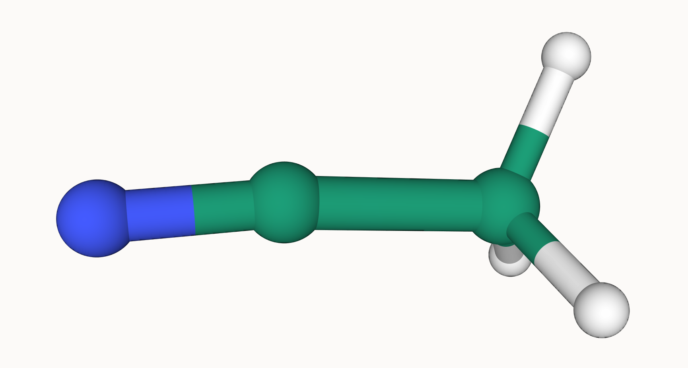
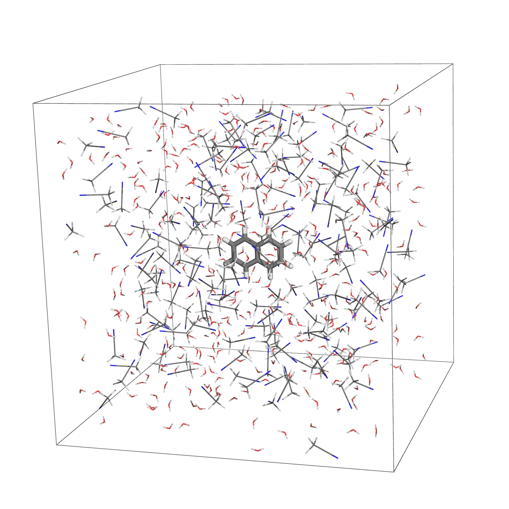
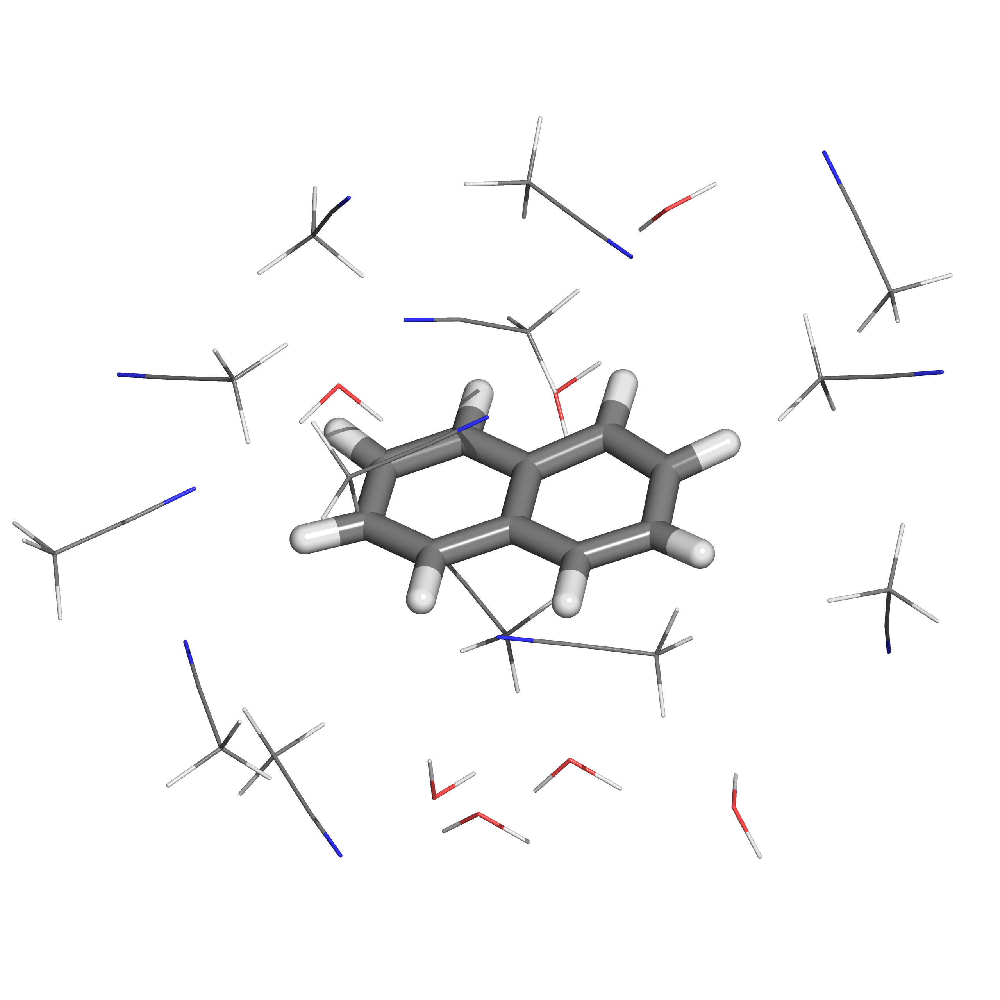

Tutorial for Mixed Solvent Box Generation
=============================
The following tutorial illustrates the basic usage of **Autosolvate Multicomponent** module in the command line interface (CLI).

There will be one example systems: naphthalene in mixed water and acetonitrile solvent. The tutorial will be broken down into three steps:

Prerequisites
-------------------------------------------
Once you have AutoSolvate and all dependencies installed you will need the pdb files for solute and solvents. However, the TIP3P water model are pre-defined in AMBER so you don't need to prepare its pdb or xyz file. Make sure run the example in its own directory to have clear separation of files.

naphthalene_neutral.xyz:
::

    18
    naphthalene neutral
     C     2.4397703245   -0.7099883961    0.0000206200
     C     2.4397218526    0.7099981201    0.0000271508
     C     1.2475921776    1.4061556571    0.0000203110
     C    -0.0000128759    0.7189947033    0.0000073141
     C    -1.2476290200    1.4061688746    0.0000008829
     C    -2.4397553974    0.7100487925   -0.0000117263
     C    -2.4397460082   -0.7099448889   -0.0000182422
     C    -1.2476288777   -1.4062156405   -0.0000121401
     C     0.0000138676   -0.7190995078    0.0000006641
     C     1.2476602178   -1.4062240260    0.0000074983
     H     1.2448250471   -2.4927306634    0.0000020169
     H    -1.2447711187   -2.4927196649   -0.0000168971
     H    -3.3840069825   -1.2452230520   -0.0000277743
     H    -3.3839437525    1.2454155894   -0.0000167697
     H    -1.2448430780    2.4926825384    0.0000062499
     H     1.2447883528    2.4926610011    0.0000242506
     H     3.3839630326    1.2452901872    0.0000373621
     H     3.3840333383   -1.2452476243    0.0000259290

.. image:: _images/tutorial4_1.jpg
   :width: 400

acetonitrile.prep:
::

   0 0 2

   modelitzacio d'acetonitril com solvent CH3CN
   ace.res
   ACE INT 0
   CHANGE  NOMIT DU BEG
   0.000000
   1 DUMM DU M       -5.298       3.870      -0.861     0.000000
   2 DUMM DU M       -5.925       3.000      -0.328     0.000000      
   3 DUMM DU M       -5.298      -3.870      -0.861     0.000000
   4 N1   YN M        0.314       1.215      -0.429    -0.489715
   5 C2   YC M        1.223       0.576      -0.198     0.382240
   6 C3   CT M        2.399      -0.250       0.102    -0.236648
   7 H4   HC E        2.688      -0.801      -0.783     0.114711
   8 H5   HC E        3.217       0.385       0.414     0.114711
   9 H6   HC E        2.159      -0.945       0.896     0.114711

   DONE
   STOP 

Now that you have the structures, make a directory for the tutorial and move the files into it:: 
   
   acetonitrile.frcmod  acetonitrile.prep  naphthalene_neutral.xyz

.. note::

   You can download all files you need to proceed with the tutorial here. 

   :download:`naphthalene_neutral.xyz <_data/multicomponent_tutorial/naphthalene_neutral.xyz>`
   :download:`acetonitrile.prep <_data/multicomponent_tutorial/acetonitrile.prep>`
   :download:`acetonitrile.frcmod <_data/multicomponent_tutorial/acetonitrile.frcmod>`  

Step-1 : Generate the mixed solvent box with JSON input.
-------------------------------------------

The first step is putting the solute in the solvent box, which uses the ``autosolvate boxgen_multicomponent`` command. The usage for multiple solvent requires a **json** file as the input, but the command line options will still be available for single solute with single solvent. 

step1_input.json:
::

   {
      "cubesize": 30,
      "solute": {
         "xyzfile": "naphthalene_neutral.xyz",
         "name": "naphthalene",
         "residue_name": "NAP"
      },
      "solvents":[
         {
               "name": "water",
               "number": 397
         },
         {
               "name": "acetonitrile", 
               "number": 175,
               "prep": "acetonitrile.prep",
               "frcmod": "acetonitrile.frcmod"
         }

      ]
   }  

The first keyword ``cubesize`` specifies the size of the solvent box in Angstrom. 

The ``solute`` section specifies the **xyz** or **pdb** file of the solute. The ``name`` and ``residue_name`` are the name of the solute and its residue name, which will be autogenerated from the structure file name if not provided.

The ``solvents`` section is a list of json objects. Here we specify 175 acetonitrile and 397 water molecule to create a mixed solution with equal mass fractions. 

.. warning::
   The calculations here assume that the density of the mixture is equal to the average of the two components, which is generally NOT true. When the actual density of the mixture is unknown, the mixed solvent box need to be fully equilibrated under the NPT ensemble before the production run. 

When defining the first solvent "water", only the name and the number of molecules are required as the TIP3P water model is already defined in AMBER.

When defining the second solvent "acetonitrile", we provided the ``acetonitrile.frcmod`` to specify the missing force field parameters. In addition, a AMBER preparation file ``acetonitrile.prep`` is provided to specify the structure, topology, atom name, dummy atoms, and atomic charge of acetonitrile.

.. note::
   The required arguments of defining a solvent has the following three cases. 

   1. For pre-defined AMBER solvents "water", "methanol", "chloroform", and "nma" (N-Methylaniline). Only the correct name and the number of molecules are required.

   2. For custom solvents with pre-defined force field parameters, a **frcmod** file is required. In addition, a structure file with correct atom types and atomic charges must be provided. This includes **prep**, **off**, **lib** and **mol2** files. 

   3. For solvents without force field parameters, one can provide the **xyz** or **pdb** file of the solvent. Then the forcefield parameters will be autogenerated with the General Amber Force Field (GAFF). 

   Multicomponent solvent box generation does not support pre-built solvent boxes.

Execute the following command to generate the solvent box of naphthalene in mixed water and acetonitrile solution::
``autosolvate boxgen_multicomponent -f step1_input.json``

Autosolvate will calculate the forcefield parameters for the solute (naphthalene_neutral), and adapt the provided acetonitrile parameters together with the TIP3P water model to build the solvent box. The output ``.pdb``, ``.prmtop``, and ``.inpcrd`` files for the generated system will be automatically named with the prefix ``naphthalene-water-acetonitrile``. You can change the prefix by specifying the ``output`` keyword in the json file.

Most output information will be printed in the ``autosolvate.log`` file in the working directory. If the command run successfully, you should now have the following files in your directory::

   acetonitrile.frcmod        leap_convert.cmd                         naphthalene.prmtop
   acetonitrile-fromprep.pdb  leap.log                                 naphthalene-water-acetonitrile.inpcrd
   acetonitrile.pdb           leap_naphthalene.cmd                     naphthalene-water-acetonitrile_packmol.inp
   acetonitrile.prep          leap_naphthalene.log                     naphthalene-water-acetonitrile_packmol.out
   ANTECHAMBER_AC.AC          leap_naphthalene-water-acetonitrile.cmd  naphthalene-water-acetonitrile.pdb
   ANTECHAMBER_AC.AC0         leap_naphthalene-water-acetonitrile.log  naphthalene-water-acetonitrile.prmtop
   ANTECHAMBER_AM1BCC.AC      naphthalene.frcmod                       sqm.in
   ANTECHAMBER_AM1BCC_PRE.AC  naphthalene.inpcrd                       sqm.out
   ANTECHAMBER_BOND_TYPE.AC   naphthalene.lib                          sqm.pdb
   ANTECHAMBER_BOND_TYPE.AC0  naphthalene.mol2                         step1_input.json
   ATOMTYPE.INF               naphthalene_neutral.xyz                  water.pdb
   autosolvate.log            naphthalene.pdb

The three files that we care about for moving forward to the next step are the ones with the output prefix ``naphthalene-water-acetonitrile`` (``naphthalene-water-acetonitrile.inpcrd``, ``naphthalene-water-acetonitrile.prmtop``, ``naphthalene-water-acetonitrile.pdb``). The ``.inpcrd`` file contains the input coordinates, and the ``.prmtop`` file contains the Amber parameter topology. The PDB file ``naphthalene-water-acetonitrile.pdb`` has the coordinates for the solvent box for visualization. You should be able to see the mixed-solvent (water/acetonitrile) box containing the solute (naphthalene):

.. note::   

   This example uses default settings for boxgen_multicomponent, which uses AM1-BCC for charge fitting with autogenerated solvent box name and default closeness 2.0 Angstrom. These parameters can be explicitly specified in the json. In addition, AutoSolvate assumes the solute and solvent is neutral and singlet. One can specify the ``charge`` and ``spinmult`` arguments in the corresponding json object if needed.
   
   For example, we can specify the charge fitting method as 'bcc', give the output the name "mybox", set the closeness to a smaller value 1.8, and explicitly define the charge and multiplicity for both the solute and the solvent acetonitrile. The charge of the solvent water cannot be specified unless a ``.xyz/.pdb`` file, or a ``.prep/.off`` and ``.frcmod`` file is provided, which will let AutoSolvate recognize it as a custom solvent instead of the pre-defined TIP3P water. The updated json file will look like this:

   step1_input.json:
   ::

      {
         "cubesize": 30,
         "chargemethod": "bcc",
         "output": "mybox",
         "closeness": 1.8,
         "solute": {
            "xyzfile": "naphthalene_neutral.xyz",
            "name": "naphthalene",
            "residue_name": "NAP",
            "charge": 0,
            "spinmult": 1
         },
         "solvents":[
            {
               "name": "water",
               "number": 397
            },
            {
               "name": "acetonitrile", 
               "number": 175,
               "prep": "acetonitrile.prep",
               "frcmod": "acetonitrile.frcmod",
               "charge": 0,
               "spinmult": 1
            }
         ]
      }  

   The semi-empirical charge fitting method AM1-BCC performs well for closed-shell systems. However, it is not sufficient for open-shell systems, which will require the use of RESP charge fitting available in Gaussian & GAMESS-US. Currently, ``bcc`` is the default setting.

Step-2 & 3 : Run MD simulation and extract microsolvated clusters.
-------------------------------------------

With the amber input coordinate and topology file (``naphthalene-water-acetonitrile.inpcrd``, ``naphthalene-water-acetonitrile.prmtop``). One can perform the following steps in the exactly the same way as described in the `autosolvate boxgen` tutorial. The following command will generate a classical MD trajectory for the mixed solvent box:

``autosolvate mdrun -f naphthalene-water-acetonitrile -q 0 -u 1 -t 300 -p 1 -i 100 -m 10000 -b 0 -n 10000 -l 0 -o 0 -s 0``

And the command for extracting microsolvated clusters is:

``autosolvate clustergen -f naphthalene-water-acetonitrile.prmtop -t naphthalene-water-acetonitrile-mmnpt.netcdf -a 0 -i 10 -s 4.0``

This will result in the following microsolvated cluster:

