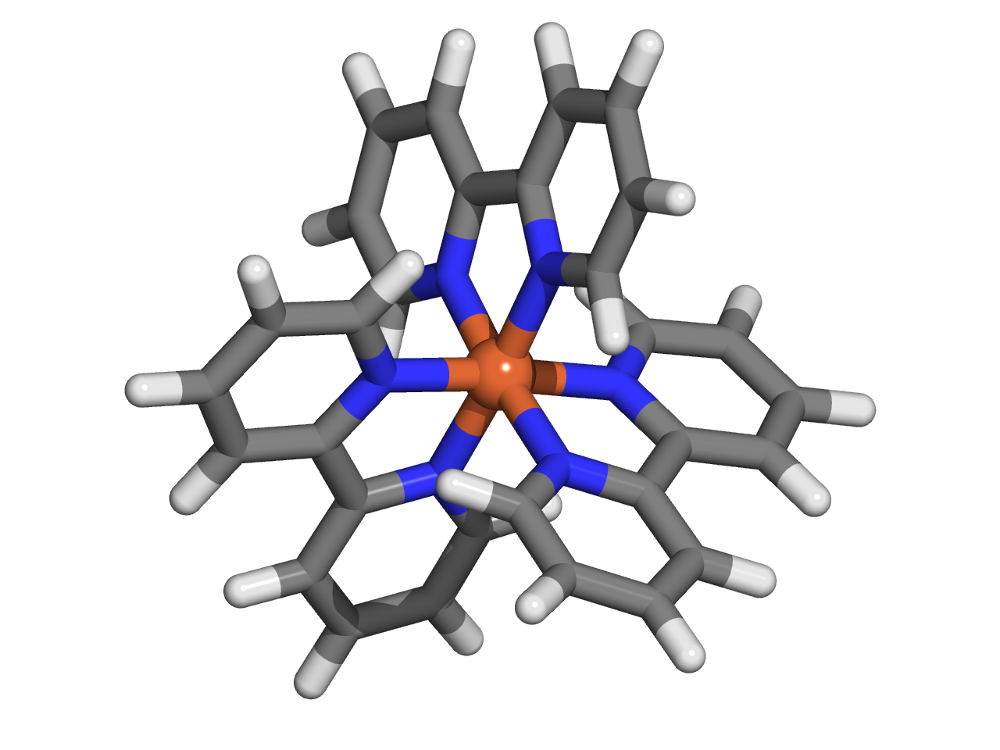

Tutorial for Force Field Generation of Organometallic Compounds
================================================================

This tutorial illustrates how to automate the force field generation for organometallic compounds using AutoSolvate via the command line interface (CLI). We will cover three systems: Fe(bpy)3 in water, Fe(bpy)3 in acetonitrile, and Fe(bpy)3 in DCM.

Prerequisites
-------------
Before starting, ensure you have AutoSolvate and all necessary dependencies installed. You will also need the organometallic compound's .xyz file for each molecule. Place each molecule in its own directory to prevent file overwriting. Quantum mechanics software such as Gaussian, Orca, or GAMESS-US is required for quantum mechanical calculations needed for force field parameterization.

You can download the necessary xyz file here:
:download:`Febpy3.xyz <_data/Febpy3.xyz>`

Example 1: Fe(bpy)3 in Water
----------------------------

**Command Line Execution**

Execute the following command to generate the force field for Fe(bpy)3 in water:

.. code-block:: bash

    autosolvate boxgen_metal -m Febpy3.xyz -c 2 -u 1 -x orca -r 32 -G /opt/orca/5.0.2/orca -e water

**Parameters:**

- ``-m``: Path to the .xyz file
- ``-c``: Charge of the metal atom
- ``-u``: Spin multiplicity of the compound
- ``-x``: Quantum mechanics software to use (gau, orca, gms)
- ``-r``: Number of processors for the QM calculation
- ``-G``: Path to the QM software executable
- ``-e``: Solvent type

**Script for Compute Node Submission**

You can use the following script to submit this job on a compute node:

.. code-block:: bash

    #!/bin/bash
    #SBATCH --time=144:00:00
    #SBATCH --partition=week-long
    #SBATCH --nodes=1
    #SBATCH --mem=1G
    #SBATCH --ntasks=32
    #SBATCH --cpus-per-task=1
    #SBATCH --partition=cpuq
    echo $HOSTNAME
    echo $SLURM_SUBMIT_DIR
    echo $SLURM_SUBMIT_HOST
    echo $SLURM_JOB_ID
    module load orca/5.0.2
    autosolvate boxgen_metal -m Febpy3.xyz -c 2 -u 1 -x orca -r 32 -G /opt/orca/5.0.2/orca -e water

**Expected Output**

When AutoSolvate runs successfully, the following messages will be printed on your screen, indicating the start of the module to generate solvent boxes and force field parameters:

.. code-block:: text

    AutoSolvate is starting in command line mode!
    Running the module to generate solvent box and force field parameters for organometallic compounds.

The output files generated throughout the process will be listed in your directory, confirming the success of the computations and parameter generation.

**Checking the Final Output**

The final step involves checking the generated parameter files, specifically the .pdb file containing the coordinates for the solute in the solvent box. You want to ensure that both the solvent and the solute are correctly placed.

.. image:: _images/advancedTutorial3_2.png
   :width: 400 px

Now, with the `.inpcrd`, `.prmtop`, and `.pdb` files, you are fully equipped to proceed to the molecular dynamics simulations.
