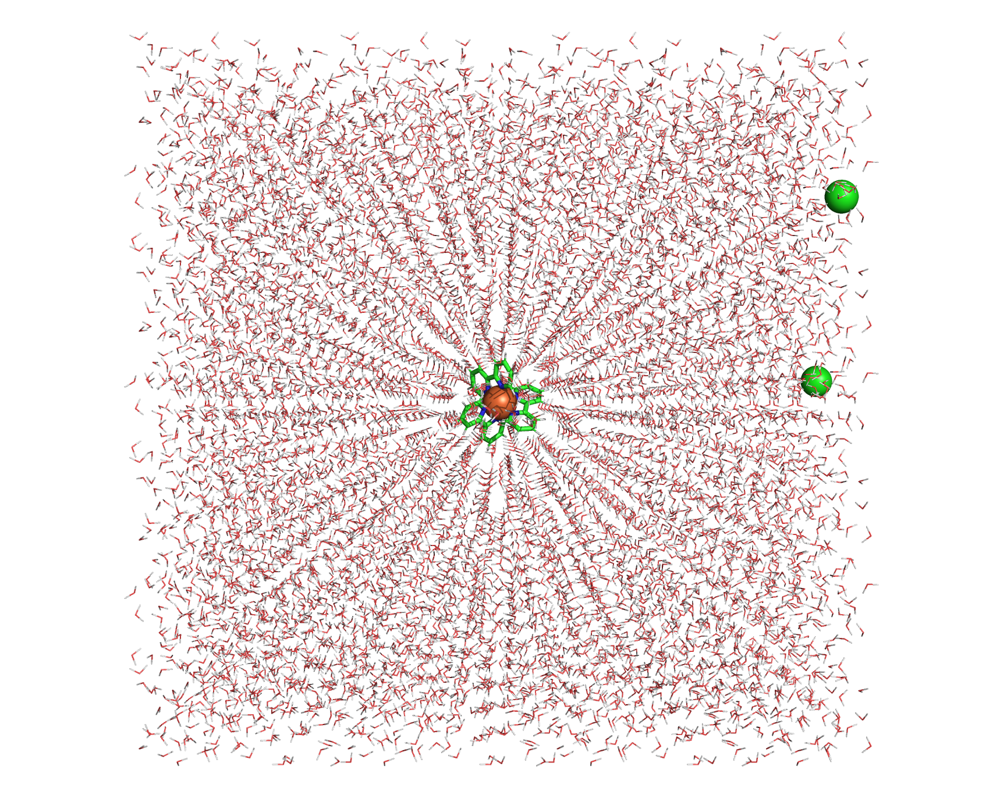

Tutorial for Force Field Generation of Organometallic Compounds
================================================================

This tutorial illustrates how to automate the force field generation for organometallic compounds using AutoSolvate via the command line interface (CLI). We will cover three systems: Fe(bpy)3 in water, Fe(bpy)3 in acetonitrile, and Fe(bpy)3 in DCM.

Prerequisites
-------------
Before starting, ensure you have AutoSolvate and all necessary dependencies installed. You will also need the organometallic compound's .xyz file for each molecule. Place each molecule in its own directory to prevent file overwriting. Quantum mechanics software such as Gaussian, Orca, or GAMESS-US is required for quantum mechanical calculations needed for force field parameterization.

.. image:: _images/metalTutorial_1.png
   :width: 400 px

You can download the necessary xyz file here:
:download:`Febpy3.xyz <_data/Febpy3.xyz>`

Example 1: Fe(bpy)3 in Water
----------------------------

**Command Line Execution**

Execute the following command to generate the force field for Fe(bpy)3 in water:
Autosolvate will use the default values for other options

.. code-block:: bash

    autosolvate boxgen_metal -m Febpy3.xyz -c 2 -u 1 -x orca -r 32 -G /opt/orca/5.0.2/orca -e water

**Parameters:**

- ``-m``: Path to the .xyz file
- ``-c``: Charge of the metal atom
- ``-u``: Spin multiplicity of the compound
- ``-x``: Quantum mechanics software to use (gau, orca, gms)
- ``-r``: Number of processors for the QM calculation
- ``-G``: Path to the QM software executable
- ``-e``: Solvent type

**Script for Compute Node Submission**

You can use the following script to submit this job on a compute node:

.. code-block:: bash

    #!/bin/bash
    #SBATCH --time=144:00:00
    #SBATCH --partition=week-long
    #SBATCH --nodes=1
    #SBATCH --mem=1G
    #SBATCH --ntasks=32
    #SBATCH --cpus-per-task=1
    #SBATCH --partition=cpuq
    echo $HOSTNAME
    echo $SLURM_SUBMIT_DIR
    echo $SLURM_SUBMIT_HOST
    echo $SLURM_JOB_ID
    module load orca/5.0.2
    autosolvate boxgen_metal -m Febpy3.xyz -c 2 -u 1 -x orca -r 32 -G /opt/orca/5.0.2/orca -e water

**Expected Output**

When AutoSolvate runs, the following messages will be printed on your screen, indicating the start of the module to generate solvent boxes and force field parameters:

.. code-block:: text

    AutoSolvate is starting in command line mode!
    Running the module to generate solvent box and force field parameters for organometallic compounds.

When the following messages are printed on your screen, it indicates that all the files required for MCPB.py are generated:

.. code-block:: text

    ******************** start to generate inputs for MCPB.py -s 1 ********************
    antechamber was processed to generate mol2 file, now checking LG0_antechamber_generate_mol2.log
    antechamber was processed to generate mol2 file, now checking LG1_antechamber_generate_mol2.log
    antechamber was processed to generate mol2 file, now checking LG2_antechamber_generate_mol2.log
    Febpy3_final.pdb is generated
    add_bonded pairs 1-2 1-13 1-22 1-33 1-42 1-53
    FE.mol2 is generated
    LG0.mol2 is generated
    LG1.mol2 is generated
    LG2.mol2 is generated
    LG0.frcmod is generated
    LG1.frcmod is generated
    LG2.frcmod is generated
    charge assigned for each ligand:
    FE 2
    LG0 0
    LG1 0
    LG2 0
    ******************** Finish generating inputs for MCPB.py -s 1 ********************

Next, QM calculations for orca_small_opt orca_small_fc orca_large_mk start, if a calculation is finished, the next will start

.. code-block:: text
    ******************** start to QM calculations for orca_small_opt orca_small_fc orca_large_mk ********************
    Next to submit Freq calculation
    ORCA opt terminated normally
    Freq calculation is finished, start to run QM charge calculation
    ORCA opt terminated normally
    start to run charge calculation

When all QM calculations converge, parameters for force field will be generated.
solvated box are packed when the screen shows:

.. code-block:: text
    ********************    start to generate the solvated box******************
    ********************    Autosolvate successfully generates Febpy3_solvated.prmtop ********************

The output files generated throughout the process will be listed in your directory, confirming the success of the computations and parameter generation.

.. code-block:: text
    autosolvate.log                    Febpy3_mcpbpy.frcmod                Febpy3_solv.prmtop                 LG0.smi                            LG2.smi
    bondinfo.in                        Febpy3_mcpbpy.pdb                   Febpy3_standard.fingerprint        LG0_temp.pdb                       LG2_temp.pdb
    bondinfo_output.txt                Febpy3_mcpbpy_pre.frcmod            Febpy3_standard.pdb                LG0.xyz                            LG2.xyz
    esp_gen.log                        Febpy3_small_fc.com                 Febpy3_temp.pdb                    LG1_antechamber_generate_mol2.log  MCPB_1.log
    esp.xyz                            Febpy3_small_fc.inp                 Febpy3_tleap_check.in              LG1_FE.xyz                         MCPB_2.log
    FE1.mol2                           Febpy3_small_fc.orca                Febpy3_tleap_check.out             LG1.frcmod                         MCPB_4.log
    Febpy3_dry.inpcrd                  Febpy3_small_fc.orca.densities      Febpy3_tleap.in                    LG1.mol2                           mcpbpy_parmed.in
    Febpy3_dry.pdb                     Febpy3_small_fc.orca.gbw            Febpy3.xyz                         LG1_obabel_smi.log                 missingbonds.txt
    Febpy3_dry.prmtop                  Febpy3_small_fc.orca.hess           FE.mol2                            LG1___.pdb                         orca.sh
    Febpy3_final_nonprot.pdb           Febpy3_small_fc.orcaout             FE.pdb                             LG1__.pdb                          output.all
    Febpy3_final.pdb                   Febpy3_small_fc.orca_property.txt   FE_temp.pdb                        LG1_.pdb                           parmed.out
    Febpy3_final_renum.txt             Febpy3_small_opt.com                FE.xyz                             LG1.pdb                            resp1_calc.esp
    Febpy3_final_sslink                Febpy3_small_opt.inp                genmetalmol2.py                    LG1.sdf                            resp1.chg
    Febpy3_final.xyz                   Febpy3_small_opt.orca               L01.mol2                           LG1_sdf.log                        resp1.in
    Febpy3.info                        Febpy3_small_opt.orca.densities     L11.mol2                           LG1.smi                            resp1.out
    Febpy3_large.fingerprint           Febpy3_small_opt.orca.engrad        L21.mol2                           LG1_temp.pdb                       resp1.pch
    Febpy3_large_mk.com                Febpy3_small_opt.orca.gbw           leap_add_solventbox.cmd            LG1.xyz                            resp2_calc.esp
    Febpy3_large_mk.inp                Febpy3_small_opt.orca.opt           leap.log                           LG2_antechamber_generate_mol2.log  resp2.chg
    Febpy3_large_mk.orca               Febpy3_small_opt.orcaout            LG0_antechamber_generate_mol2.log  LG2_FE.xyz                         resp2.in
    Febpy3_large_mk.orca.densities     Febpy3_small_opt.orca_property.txt  LG0_FE.xyz                         LG2.frcmod                         resp2.out
    Febpy3_large_mk.orca.esp           Febpy3_small_opt.orca_trj.xyz       LG0.frcmod                         LG2.mol2                           resp2.pch
    Febpy3_large_mk.orcaespout         Febpy3_small_opt.orca.xyz           LG0.mol2                           LG2_obabel_smi.log                 respinputgen.log
    Febpy3_large_mk.orca.gbw           Febpy3_small.pdb                    LG0_obabel_smi.log                 LG2___.pdb                         slurm-332789.out
    Febpy3_large_mk.orca.K.tmp         Febpy3_small.res                    LG0___.pdb                         LG2__.pdb                          sqm.in
    Febpy3_large_mk.orcaout            Febpy3_solvated.inpcrd              LG0__.pdb                          LG2_.pdb                           sqm.out
    Febpy3_large_mk.orca_property.txt  Febpy3_solvated.pdb                 LG0_.pdb                           LG2.pdb                            sqm.pdb
    Febpy3_large.pdb                   Febpy3_solvated.prmtop              LG0.pdb                            LG2_pdb4amber.log                  tleap.log
    Febpy3_MCPB.in                     Febpy3_solv.inpcrd                  LG0.sdf                            LG2.sdf                            tleap_MCPB.log
    Febpy3_MCPB_orca.in                Febpy3_solv.pdb                     LG0_sdf.log                        LG2_sdf.log  
   

**Checking the Final Output**

The final step involves checking the generated parameter files, specifically the .pdb file containing the coordinates for the solute in the solvent box. You want to ensure that both the solvent and the solute are correctly placed.

Now, with the `Febpy3_solvated.inpcrd`, `Febpy3_solvated.prmtop`, and `Febpy3_solvated.pdb` files, you are fully equipped to proceed to the molecular dynamics simulations.
