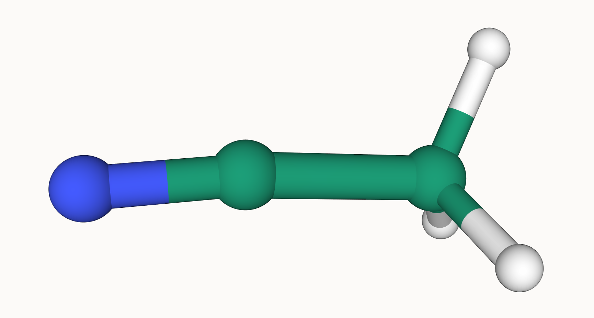
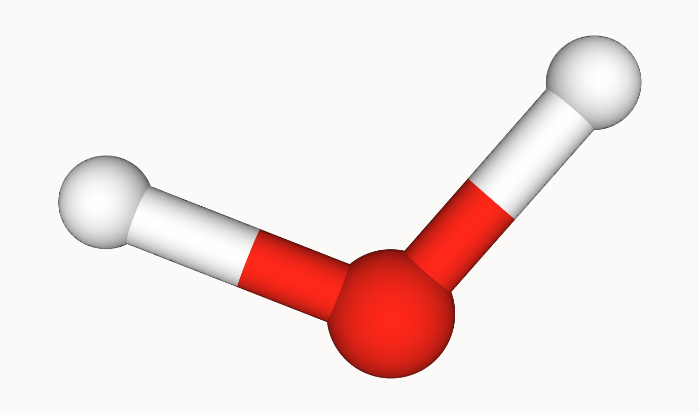
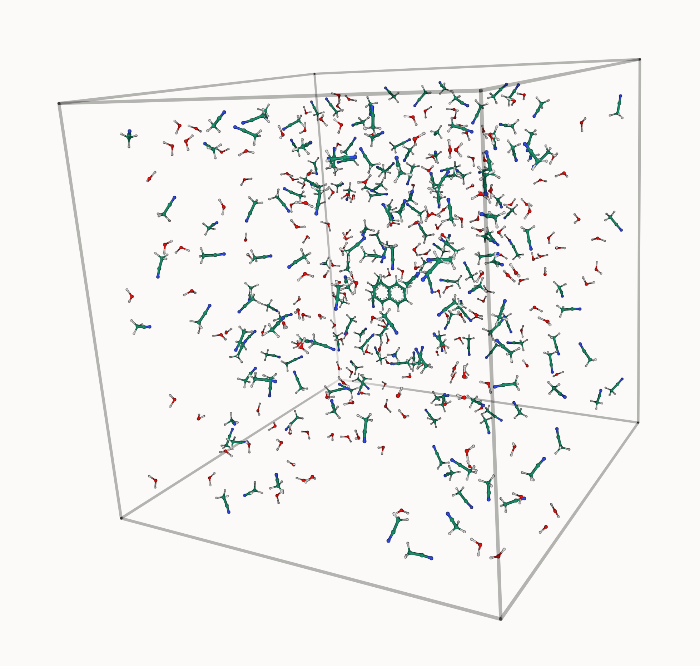
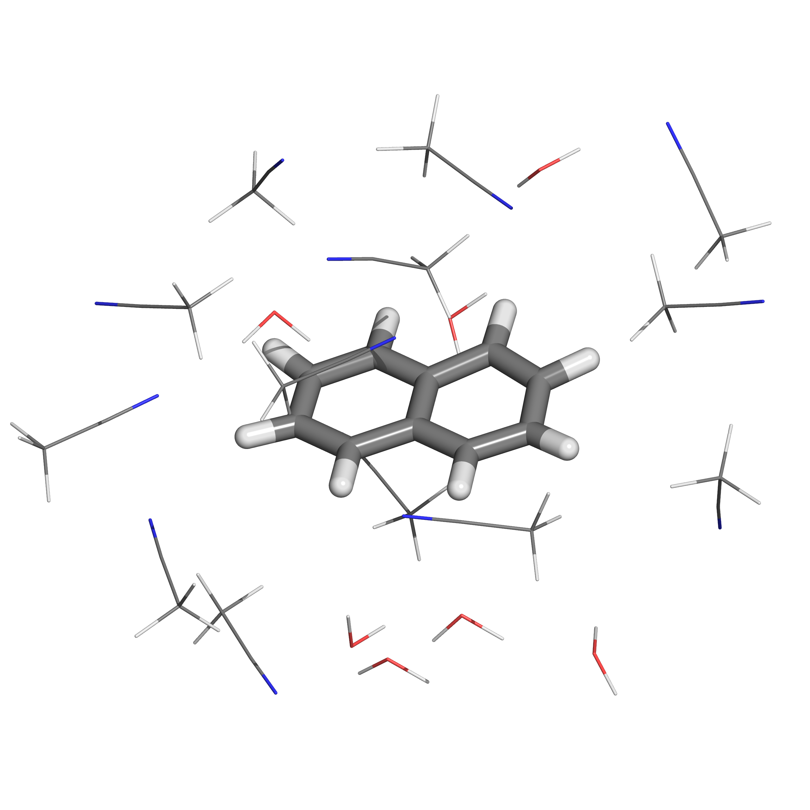

Tutorial
=============================
The following tutorial illustrates the basic usage of **Autosolvate Multicomponent** module in the command line interface (CLI).

There will be one example systems: naphthalene in mixed water and acetonitrile solvent. The tutorial will be broken down into three steps:

Prerequisites
-------------------------------------------
Once you have AutoSolvate and all dependencies installed you will need the pdb files for solute and solvents. Mak sure run the example in its own directory to have clear separation of files.

.. image:: _images/tutorial4_1.jpg
   :width: 400

naphthalene_neutral.xyz:
::

    18
    naphthalene neutral
     C     2.4397703245   -0.7099883961    0.0000206200
     C     2.4397218526    0.7099981201    0.0000271508
     C     1.2475921776    1.4061556571    0.0000203110
     C    -0.0000128759    0.7189947033    0.0000073141
     C    -1.2476290200    1.4061688746    0.0000008829
     C    -2.4397553974    0.7100487925   -0.0000117263
     C    -2.4397460082   -0.7099448889   -0.0000182422
     C    -1.2476288777   -1.4062156405   -0.0000121401
     C     0.0000138676   -0.7190995078    0.0000006641
     C     1.2476602178   -1.4062240260    0.0000074983
     H     1.2448250471   -2.4927306634    0.0000020169
     H    -1.2447711187   -2.4927196649   -0.0000168971
     H    -3.3840069825   -1.2452230520   -0.0000277743
     H    -3.3839437525    1.2454155894   -0.0000167697
     H    -1.2448430780    2.4926825384    0.0000062499
     H     1.2447883528    2.4926610011    0.0000242506
     H     3.3839630326    1.2452901872    0.0000373621
     H     3.3840333383   -1.2452476243    0.0000259290

acetonitrile.pdb:
::
   ATOM      1  N1  ACE     1      14.182  11.288  13.720  1.00  0.00
   ATOM      2  C2  ACE     1      13.673  12.188  13.299  1.00  0.00
   ATOM      3  C3  ACE     1      13.153  13.383  12.698  1.00  0.00
   ATOM      4  H4  ACE     1      13.342  13.429  11.678  1.00  0.00
   ATOM      5  H5  ACE     1      12.069  13.440  12.762  1.00  0.00
   ATOM      6  H6  ACE     1      13.602  14.242  13.212  1.00  0.00
   TER   
   END   

water.pdb:
:: 
   ATOM      1  O   WAT     1       0.251  -0.360  -0.046  1.00  0.00
   ATOM      2  H   WAT     1       0.249   0.684   0.231  1.00  0.00
   ATOM      3  H1  WAT     1       0.586  -0.954   0.791  1.00  0.00
   TER   
   END

.. note::

  You can download the xyz files and pdb files here:

  :download:`naphthalene_neutral.xyz <_data/naphthalene_neutral.xyz>`  
  
  :download:`acetonitrile.pdb <_data/acetonitrile.pdb>`   
  
  :download:`water.pdb <_data/water.pdb>`   

Now that you have the structures, make a directory for the tutorial and move the files into it:: 
   
   acetonitrile.pdb  naphthalene_neutral.xyz  water.pdb

.. note::

   You can find the ``tutorial_step1`` folder here: 

   :download:`tutorial_step1 <_data/multicomponent_tutorial/example1/tutorial_step1>`  

   It includes all the files you need to proceed with the step 1 of the tutorial. 

Example 1: Naphthalene in mixed water and acetonitrile solution
-----------------------------------------------------------------------

Step 1: Solvate system
~~~~~~~~~~~~~~~~~~~~~~~~~~~~~~~~~~~~~~~~~~~~~~~~~~~~~~~~~~~~~~~~~~~~~~~

The first step is putting the solute in the solvent box, which uses the ``boxgen_multicomponent`` command. The documentation shows all of the options for this command, but the only one that is required is specifying the solute xyz file and the solvents pdb files. It will be listed as -m for main, -s for solvents. To run boxgen_multicomponent with all of the default settings, use the following command:

``autosolvate boxgen_multicomponent -m naphthalene_neutral.xyz  -s water.pdb/acetonitrile.pdb``

.. note::
   If you saw this error message:
      NameError: name '_read_utf8_with_fallback' is not defined

   It means you did not install and complie the AutoSolvate properly, please install and complie the AutoSolvate in the new conda Environment. 

.. note::
   
   Note::
      
      Note to Autosolvate Developers

      (1) Please test if '-m' and '-s' command fully support both xyz and pdb file inputs which means if someone provides xyz file, the Multicomponent module will convert the xyz file into pdb file using openbable. 

      (2) Please implement a way to allow user to specify the solute charges and multiplicities. 
      
         The idea case is allow user to provide a .inp document for the Multicomponent to read. 

         For example autosolvate boxgen_multicomponent -m naphthalene_neutral.xyz -s solvents.inp 

         The solvents.inp file will look like this: 
            #xyzfile, charge, multiplicities
            water.xyz 0 1 
            acetonitrile.xyz 0 1 

      (3) Please implement a way to allow user to use TIP3P water and other solvents AMBER already has force field parameters for. 

Autosolvate will use the calculate force field parameters for the solute (naphthalene_neutral) and solvents (water/acetonitrile). By default, the command will assume the charge of solute and solvents are neutral, and the multiplicity of the solute and solvents are 1, charge fitting method of bcc and output file name of MYBOX. 

If AutoSolvate is running successfully, the following messages will be printed to your screen::

   AutoSolvate is starting in command line mode!
   Running the module to generate solvent box and force field parameters for multicomponent systems.
   Main/solutexyz naphthalene_neutral.xyz
   Solvent: water.pdb/acetonitrile.pdb
   1 molecule converted

   Welcome to antechamber 22.0: molecular input file processor.

   Info: acdoctor mode is on: check and diagnose problems in the input file.
   Info: The atom type is set to gaff; the options available to the -at flag are
         gaff, gaff2, amber, bcc, and sybyl.

   -- Check Format for pdb File --
      Status: pass
   -- Check Unusual Elements --
      Status: pass
   -- Check Open Valences --
      Status: pass
   -- Check Geometry --
         for those bonded   
         for those not bonded   
      Status: pass
   -- Check Weird Bonds --
      Status: pass
   -- Check Number of Units --
      Status: pass
   acdoctor mode has completed checking the input file.

   Info: Total number of electrons: 68; net charge: 0

   Running: /home/pli/anaconda3/envs/autosolvate/bin/sqm -O -i sqm.in -o sqm.out

   1 molecule converted

   Welcome to antechamber 22.0: molecular input file processor.

   Info: acdoctor mode is on: check and diagnose problems in the input file.
   Info: The atom type is set to gaff; the options available to the -at flag are
         gaff, gaff2, amber, bcc, and sybyl.

   -- Check Format for pdb File --
      Status: pass
   -- Check Unusual Elements --
      Status: pass
   -- Check Open Valences --
      Status: pass
   -- Check Geometry --
         for those bonded   
         for those not bonded   
      Status: pass
   -- Check Weird Bonds --
      Status: pass
   -- Check Number of Units --
      Status: pass
   acdoctor mode has completed checking the input file.

   Info: Total number of electrons: 10; net charge: 0

   Running: /home/pli/anaconda3/envs/autosolvate/bin/sqm -O -i sqm.in -o sqm.out

   1 molecule converted

   Welcome to antechamber 22.0: molecular input file processor.

   Info: acdoctor mode is on: check and diagnose problems in the input file.
   Info: The atom type is set to gaff; the options available to the -at flag are
         gaff, gaff2, amber, bcc, and sybyl.

   -- Check Format for pdb File --
      Status: pass
   -- Check Unusual Elements --
      Status: pass
   -- Check Open Valences --
      Status: pass
   -- Check Geometry --
         for those bonded   
         for those not bonded   
      Status: pass
   -- Check Weird Bonds --
      Status: pass
   -- Check Number of Units --
      Status: pass
   acdoctor mode has completed checking the input file.

   Info: Total number of electrons: 22; net charge: 0

   Running: /home/pli/anaconda3/envs/autosolvate/bin/sqm -O -i sqm.in -o sqm.out

Additionally, you should now have the following files in your directory::

   acetonitrile.frcmod        leap_acetonitrile.log         naphthalene_neutral.mol2
   acetonitrile.inpcrd        leap.log                      naphthalene_neutral.pdb
   acetonitrile.lib           leap_MYBOX.cmd                naphthalene_neutral.prmtop
   acetonitrile.mol2          leap_MYBOX.log                naphthalene_neutral.xyz
   acetonitrile.pdb           leap_naphthalene_neutral.cmd  sqm.in
   acetonitrile.prmtop        leap_naphthalene_neutral.log  sqm.out
   acetonitrile.xyz           leap_water.cmd                sqm.pdb
   ANTECHAMBER_AC.AC          leap_water.log                water.frcmod
   ANTECHAMBER_AC.AC0         MYBOX.inpcrd                  water.inpcrd
   ANTECHAMBER_AM1BCC.AC      MYBOX_packmol.inp             water.lib
   ANTECHAMBER_AM1BCC_PRE.AC  MYBOX_packmol.out             water.mol2
   ANTECHAMBER_BOND_TYPE.AC   MYBOX.pdb                     water.pdb
   ANTECHAMBER_BOND_TYPE.AC0  MYBOX.prmtop                  water.prmtop
   ATOMTYPE.INF               naphthalene_neutral.frcmod    water.xyz
   autosolvate.log            naphthalene_neutral.inpcrd
   leap_acetonitrile.cmd      naphthalene_neutral.lib

The three files that we care about for moving forward to the next step are the ones with the output prefix MYBOX (MYBOX.inpcrd, MYBOX.prmtop, MYBOX.pdb). The ``.inpcrd`` file contains the input coordinates, and the ``.prmtop`` file contains the Amber parameter topology. The ``.pdb`` file has the coordinates for the solvent box, so you want to check that both the solvent and the solute are there. The block below shows the first few lines of the ``.pdb`` file::

      CRYST1   56.000   56.000   56.000  90.00  90.00  90.00 P 1           1
      ATOM      1  C   NAP     1      29.440  26.290  27.000  1.00  0.00
      ATOM      2  C1  NAP     1      29.440  27.710  27.000  1.00  0.00
      ATOM      3  C2  NAP     1      28.248  28.406  27.000  1.00  0.00
      ATOM      4  C3  NAP     1      27.000  27.719  27.000  1.00  0.00
      ATOM      5  C4  NAP     1      25.752  28.406  27.000  1.00  0.00
      ATOM      6  C5  NAP     1      24.560  27.710  27.000  1.00  0.00
      ATOM      7  C6  NAP     1      24.560  26.290  27.000  1.00  0.00
      ATOM      8  C7  NAP     1      25.752  25.594  27.000  1.00  0.00
      ATOM      9  C8  NAP     1      27.000  26.281  27.000  1.00  0.00
      ATOM     10  C9  NAP     1      28.248  25.594  27.000  1.00  0.00
      ATOM     11  H   NAP     1      28.245  24.507  27.000  1.00  0.00
      ATOM     12  H1  NAP     1      25.755  24.507  27.000  1.00  0.00
      ATOM     13  H2  NAP     1      23.616  25.755  27.000  1.00  0.00
      ATOM     14  H3  NAP     1      23.616  28.245  27.000  1.00  0.00
      ATOM     15  H4  NAP     1      25.755  29.493  27.000  1.00  0.00
      ATOM     16  H5  NAP     1      28.245  29.493  27.000  1.00  0.00
      ATOM     17  H6  NAP     1      30.384  28.245  27.000  1.00  0.00
      ATOM     18  H7  NAP     1      30.384  25.755  27.000  1.00  0.00
      TER   
      ATOM     19  O   WAT     2      39.703  19.741  21.984  1.00  0.00
      ATOM     20  H   WAT     2      40.098  20.279  21.135  1.00  0.00
      ATOM     21  H1  WAT     2      40.367  19.860  22.827  1.00  0.00
      TER   
      ATOM     22  O   WAT     3      20.966  19.593   6.288  1.00  0.00
      ATOM     23  H   WAT     3      21.989  19.277   6.146  1.00  0.00
      ATOM     24  H1  WAT     3      20.652  20.188   5.444  1.00  0.00
      TER   
      ATOM     25  O   WAT     4      44.585  14.042  40.563  1.00  0.00
      ATOM     26  H   WAT     4      45.613  13.879  40.274  1.00  0.00
      ATOM     27  H1  WAT     4      43.936  13.439  39.945  1.00  0.00
      TER   
      ...
      ATOM    691  N1  ACE   214      41.425  23.650  23.309  1.00  0.00
      ATOM    692  C2  ACE   214      42.456  23.301  23.557  1.00  0.00
      ATOM    693  C3  ACE   214      43.757  22.737  23.780  1.00  0.00
      ATOM    694  H4  ACE   214      44.283  22.591  22.897  1.00  0.00
      ATOM    695  H5  ACE   214      44.400  23.397  24.358  1.00  0.00
      ATOM    696  H6  ACE   214      43.625  21.786  24.312  1.00  0.00
      TER   
      ATOM    697  N1  ACE   215      28.384  44.128  36.083  1.00  0.00
      ATOM    698  C2  ACE   215      27.683  44.880  35.648  1.00  0.00
      ATOM    699  C3  ACE   215      26.801  45.776  34.955  1.00  0.00
      ATOM    700  H4  ACE   215      26.042  45.276  34.453  1.00  0.00
      ATOM    701  H5  ACE   215      26.269  46.439  35.633  1.00  0.00
      ATOM    702  H6  ACE   215      27.403  46.366  34.253  1.00  0.00
      TER   
      ATOM    703  N1  ACE   216       7.103  33.721  29.910  1.00  0.00
      ATOM    704  C2  ACE   216       7.537  34.606  30.435  1.00  0.00
      ATOM    705  C3  ACE   216       7.991  35.828  31.036  1.00  0.00
      ATOM    706  H4  ACE   216       7.225  36.347  31.507  1.00  0.00
      ATOM    707  H5  ACE   216       8.711  35.654  31.832  1.00  0.00
      ATOM    708  H6  ACE   216       8.446  36.442  30.249  1.00  0.00
      TER
      ...

The pdb file format is as follows::

   COLUMN     DESCRIPTION
   ------     ----------------------------
   1-6       Record Name ("ATOM" indicates a line containing information about an atom, while "TER" marks the end of a chain of atoms.)
   7-11      Atom serial number (1)
   13-16     Atom name (Ex. "O", "H", "H1") 
   17        Alternate location indicator (optional, usually blank)
   18-20     Residue name (Ex. "WAT", "ACE")
   22        Chain identifier (optional, usually blank)
   23-26     Residue sequence number (1 for one naphthalene molecule, 2 for one water molecule, 214 for one acetonitrile molecule)
   27        Code for insertion of residues (optional, usually blank)
   31-38     X coordinate (29.440)
   39-46     Y coordinate (26.290)
   47-54     Z coordinate (27.000)
   55-60     Occupancy (1.00)
   61-66     Temperature factor or B-factor (default 0.00)
   77-78     Element symbol (right-justified, 'N') (left blank in our example files in the tutorial)

When you visualize ``MYBOX.pdb`` you should be able to see the mixed-solvent (water/acetonitrile) box containing the solute (naphthalene):

With these three files (``MYBOX.inpcrd``, ``MYBOX.prmtop``, ``MYBOX.pdb``), we are ready to proceed to the next step!
 
.. note::   

   This example uses default settings for boxgen_multicomponent, but these can be changed or simply made explicit by using more flag options. For example, we can change the charge fitting method to bcc, give the output a more specific name, and explicitly define solvent, charge and multiplicity:

   ``autosolvate boxgen -m naphthalene_neutral.xyz -s water -c 0 -u 1 -g "bcc" -o nap_neutral``

   The semi-empirical charge fitting available through Amber performs well for closed-shell systems. However, it is not sufficient for open-shell systems, which will require the use of quantum chemistry charge fitting methods. The methods currently available are bcc fitting in Amber and RESP in Gaussian. RESP is the default setting.

.. note::   

   Note::

      Note to Autosolvate Developers

      There are many flags in startmulticomponent() not working. 

      -o, --output. Currently, we can not specify the output names. Please implement this feature and make sure it works. 

      -r, --srunuse. Not implemented at all 

      -e, --gaussianexe. Not sure if we need this flag. 

      -d, --gaussiandir. Not sure if we need this flag. 

      -a, --amberhome. Not sure if we need this flag 

      -l, --solventoff. MixtureBuilder() can read solvent.off file, I have not implmented and tested this flag 

      -p, --solventfrcmod Same as above. 

      -g --chargefitting. Currently only support bcc. Please implement RESP charge fitting method.

.. _tutstep2:

Step 2 Prerequisites
~~~~~~~~~~~~~~~~~~~~~~~~~~~~~~~~~~~~~~~~~~~

Before running the second step, I strongly suggest you make a new directory for the next step. Files generated in the first step might cause bugs in the second step.

You should the following files only in your directory:: 
   
   MYBOX.inpcrd  MYBOX.pdb  MYBOX.prmtop

.. note::

   You can find the ``tutorial_step2`` folder here: 

   :download:`tutorial_step2 <_data/multicomponent_tutorial/example1/tutorial_step2>`  

   It includes all the files you need to proceed with the step 2 of the tutorial. 

Step 2: MD Simulation
~~~~~~~~~~~~~~~~~~~~~~~~~~~~~~~~~~~~~~~~~~~

The second step is running molecular dynamics, which includes equilibration and production time. For this tutorial, we will run a very fast demonstration just to see how the mdrun command works.

.. note::

   'autosolvate mdrun' command uses TeraChem. Make sure you have TeraChem installed and module loaded.

   Load your TeraChem module with the following command: 
      module load TeraChem/mpich2  (replace the TeraChem path with your local TeraChem path) 

.. note::
   
   Note::

      Note for AutoSolvate Developers

      It seems the autosolvate mdrun command will not work if you use nohup. 

      Please test and try to fix this issue. 

To do a short example run of QM/MM use the following command:

``autosolvate mdrun -f MYBOX -q 0 -u 1 -t 300 -p 1 -m 10000 -n 10000 -o 10 -s 10 -l 25 -r``
  
The mdrun command has several more options than the previous one, but the only required options are filename, charge, and multiplicity (the first three in the command above). Note that this command will run both MM and QMMM. By default, the calculations will proceed in the order MM min > MM heat > MM NPT > QMMM min > QMMM heat > QMMM NVT. Any of these can be skipped by setting the number of steps to 0 ( -m, -n, -l, -o, -s). If you computer does not use srun, please remove the ``-r`` in the above command. Currently only TeraChem is supported for the QMMM step.

.. note::
   The ``-r`` option should be used only if you run AutoSolvate on a computer cluster with the `Slurm Workload Manager <https://slurm.schedmd.com/>`_. In that case, the command ``srun`` will be prepended to all commands to run MD simulation.

   If you use a desktop or laptop, it is highly likely that you don't have Slurm Workload Manaer, and you don't need the ``-r`` option.

   If you use AutoSolvate on a computer cluster with other type of Workload managers like `SGE, Torque <https://en.wikipedia.org/wiki/TORQUE>`_, or `PBS <https://en.wikipedia.org/wiki/Portable_Batch_System>`_, the ``-r`` option won't work either.

   For more explanations about the ``-r`` option, please see :ref:`this warning message <roption>`. 

If AutoSolvate is running successfully, the following messages will be printed to your screen::

   AutoSolvate is starting in command line mode!
   Running the module to automatically run MD simulations of solvated structure.
   Filename: MYBOX
   Charge: 0
   Spinmultiplicity: 1
   Temperature in K: 300
   Pressure in bar: 1
   Steps MM heat: 10000
   Steps MM NPT: 10000
   Steps QMMM heat: 10
   Steps QMMM NPT: 10
   Steps QMMM min: 25
   using srun
   MM Energy minimization
   MM Heating
   MM NPT equilibration
   QMMM Energy minimization
   QMMM Heating
   QMMM NVT Run
  
Additionally, these files should all be in your directory now::
 
   autosolvate.log  MYBOX-heat.netcdf      qmmmheat.out
   inpfile.xyz      MYBOX.inpcrd           qmmmmin.in
   mmheat.in        MYBOX-mmnpt.netcdf     qmmmmin.info
   mmheat.info      MYBOX.pdb              qmmmmin.out
   mmheat.out       MYBOX.prmtop           qmmm.ncrst
   mmmin.in         MYBOX-qmmmheat.netcdf  qmmmnve.in
   mmmin.info       MYBOX-qmmmmin.netcdf   qmmmnvt.in
   mmmin.out        MYBOX-qmmmnvt.netcdf   qmmmnvt.info
   mm.ncrst         old.tc_job.dat         qmmmnvt.out
   mmnpt.in         old.tc_job.inp         qmmm_region.pdb
   mmnpt.info       ptchrg.xyz             scr
   mmnpt.out        qmmmheat.in            tc_job.tpl
   mmnve.in         qmmmheat.info          tc_job.tpl.bak

Once everything has finished, the main output is the QM/MM trajectory ``MYBOX-qmmmnvt.netcdf``. When you have this file, you can move on to the next step!

.. warning::

   Longer MM and QM/MM steps are necessary to reach equilibration, and the default settings are more appropriate than what is used here for a production run. 

The default mdrun will have the following settings:

+-----------+-----------------------+------------+
| MD step   | default settings      |flag        |
+===========+=======================+============+
| MM min    |300 K, 1 bar           |   -t, -p   |
+-----------+-----------------------+------------+  
| MM heat   |10000 steps            |   -m       |
+-----------+-----------------------+------------+  
| MM NPT    |300000 steps           |   -n       |
+-----------+-----------------------+------------+  
| QMMM      |0, 1, b3lyp            |-q, -u, -k  | 
+-----------+-----------------------+------------+  
| QMMM min  |250 steps              |   -l       |
+-----------+-----------------------+------------+  
| QMMM heat |1000 steps             |   -o       |
+-----------+-----------------------+------------+  
| QMMM NVT  |10000 steps            |   -s       |
+-----------+-----------------------+------------+  

.. warning::

    Some simulation parameters cannot be currently set by the user, for example: 

        * simulation time step
        * integrator type
        * nonbonded cutoff
        * thermostat type
        * Langevin collision frequency
        * barostat type
        * pressure relaxation time
        * frequency of trajectory writing

When you are ready to do a production run and want to use all of these defaults, you can use the dry run option to generate the input files without running them to make sure that everything looks right: 

``autosolvate mdrun -f MYBOX -q 0 -u 1 -d``
  
If AutoSolvate is running successfully, the following messages will be printed to your screen::

   AutoSolvate is starting in command line mode!
   Running the module to automatically run MD simulations of solvated structure.
   Filename: MYBOX
   Charge: 0
   Spinmultiplicity: 1
   Dry run mode: only generate the commands to run MD programs and save them into a file without executing the commands
   MM Energy minimization
   MM Heating
   MM NPT equilibration
   QMMM Energy minimization
   QMMM Heating
   QMMM NVT Run

The following files will be added to your directory::

autosolvate.log  MYBOX.inpcrd  qmmmnve.in
mmheat.in        MYBOX.pdb     qmmmnvt.in
mmmin.in         MYBOX.prmtop  runMM.sh
mmnpt.in         qmmmheat.in   runQMMMM.sh
mmnve.in         qmmmmin.in    tc_job.tpl

Inside ``runMM.sh`` and ``runQMMMM.sh``, you will find the commands to run each step of MM and QMMM, respectively. These commands can be copied and pasted into the command line to be run one at a time or can all be pasted into a separate submit script to get the jobs queued on a compute node.

.. _roption:

.. warning::

   Especially in this step, it is important to know where your job is running!

   * If you run the autosolvate commands from the command line on a system using srun, you have to include ``-r``. Otherwise AutoSolvate will run *on the head node without entering a queue* and not using ``srun``. The administrator will likely cancel your job if you are using HPC resources.
   * If you run AutoSolvate on a system without srun, don't include ``-r`` in the MD Simulation step, otherwise your job will fail with ``srun: not found``. 
   * If you use the -r flag, AutoSolvate will run the MD simulations *on the compute node*.
   * If you do not use the -r flag, but call the autosolvate command in your own submit script, AutoSolvate will run *on a compute node in the queue* with whatever settings you designate. If you are running QMMM, this is also where you will load Terachem for the QM part.
   

Step 3 Prerequisites
~~~~~~~~~~~~~~~~~~~~~~~~~~~~~~~~~~~~~~~~~~~

Unlike the second step, you do not need to create a separate directory for the third step. You can use the same directory where you ran the second step.

Before you run the third step, you should have the following files in your directory:: 
   
   MYBOX-qmmmnvt.netcdf  MYBOX.prmtop

.. note::

   You can find the ``tutorial_step3`` folder here: 

   :download:`tutorial_step3 <_data/multicomponent_tutorial/example1/tutorial_step3>`  

   It includes all the files you need to proceed with the step 3 of the tutorial. 

Step 3: Microsolvated cluster extraction
~~~~~~~~~~~~~~~~~~~~~~~~~~~~~~~~~~~~~~~~~~~

The last step is extracting a cluster from the previous results that can be used for microsolvation. In the QMMM above, the solute is treated with QM and the explicit solvent molecules are treated with MM. In this step, a cluster will be extracted from the QMMM box so that the cluster can be treated with QM. The explicitly solvated cluster will be surrounded by implicit solvent, and we refer to the implicit + explicit combination as microsolvation.

To extract the cluster from the final QMMM results, use the following command:

``autosolvate clustergen -f MYBOX.prmtop -t MYBOX-qmmmnvt.netcdf``

.. note::

  If you were not able to run the QMMM simulation above, you can download the QM/MM trajectory here:

  :download:`MYBOX-qmmmnvt.netcdf <_data/MYBOX-qmmmnvt.netcdf>`

The .prmtop and .netcdf filenames are required, but Autosolvate will use the default values of 0 for the starting frame, 100 for the extraction interval, and a cutout size of 4 Å.

If AutoSolvate is running successfully, the following messages will be printed to your screen::

   AutoSolvate is starting in command line mode!
   Running the module to extract microsolvated clusters from MD trajectories with solvent box.
   Filename: MYBOX.prmtop
   Trajectory name: MYBOX-qmmmnvt.netcdf
   ['NAP'] [0, 1, 2, 3, 4, 5, 6, 7, 8, 9, 10, 11, 12, 13, 14, 15, 16, 17]
   select solvent molecules
   for first frame selected 17 solvent molecules
   saving xyz
   MYBOX-cutoutn-0.xyz

The output of this command will be the cartesian coordinates of the microsolvated clusters in ``MYBOX-cutoutn-*.xyz``, with * showing the frame number. When you open one of cut out files, the microsolvated cluster should look like this:

Running the above command only generates one xyz file because we only did 10 steps of the QMMM NVT in our example mdrun, and we asked for a cluster from every hundred frames. However, if we extract every 5 steps (with option `-i 5`), then we will get 2 coordinate files. We can increase the solvent shell size to 6 Å with `-s 6`. 

``autosolvate clustergen -f MYBOX.prmtop -t MYBOX-qmmmnvt.netcdf -a 0 -i 5 -s 6``

As Autosolvate is running, you will notice this line now includes the list of the 2 frames that the clusters will be extracted from::

  extracting from frames: [0, 5]

If you want spherical solvent shells instead of the default aspherical solvent shells add ``-p`` to the end of the previous command. Then the solvent shell size is measured from the center of mass of the solute.

.. warning::

   The naming of the microsolvated clusters is based on the name of the .prmtop file, not the trajectory file, so the names will not change between runs. This means that if you run the clustergen command twice, *the new coordinates will overwrite the old ones* (if the frame number is the same). Therefore, if you want to extract clusters from multiple MD steps (like QMMM heat and QMMM NVT), you need to either move or rename the files before you run the command again.